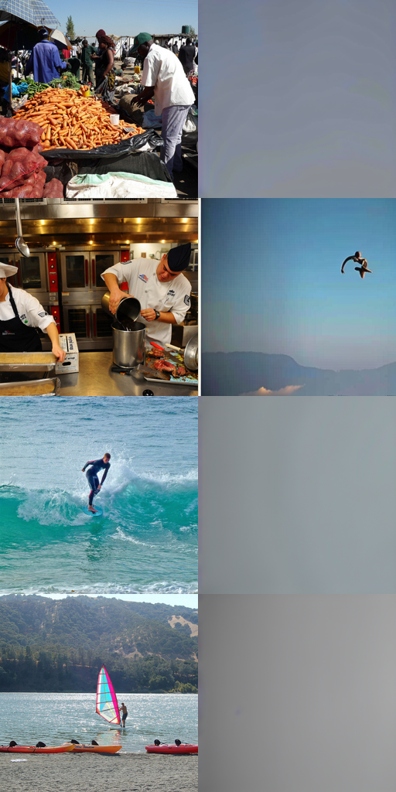
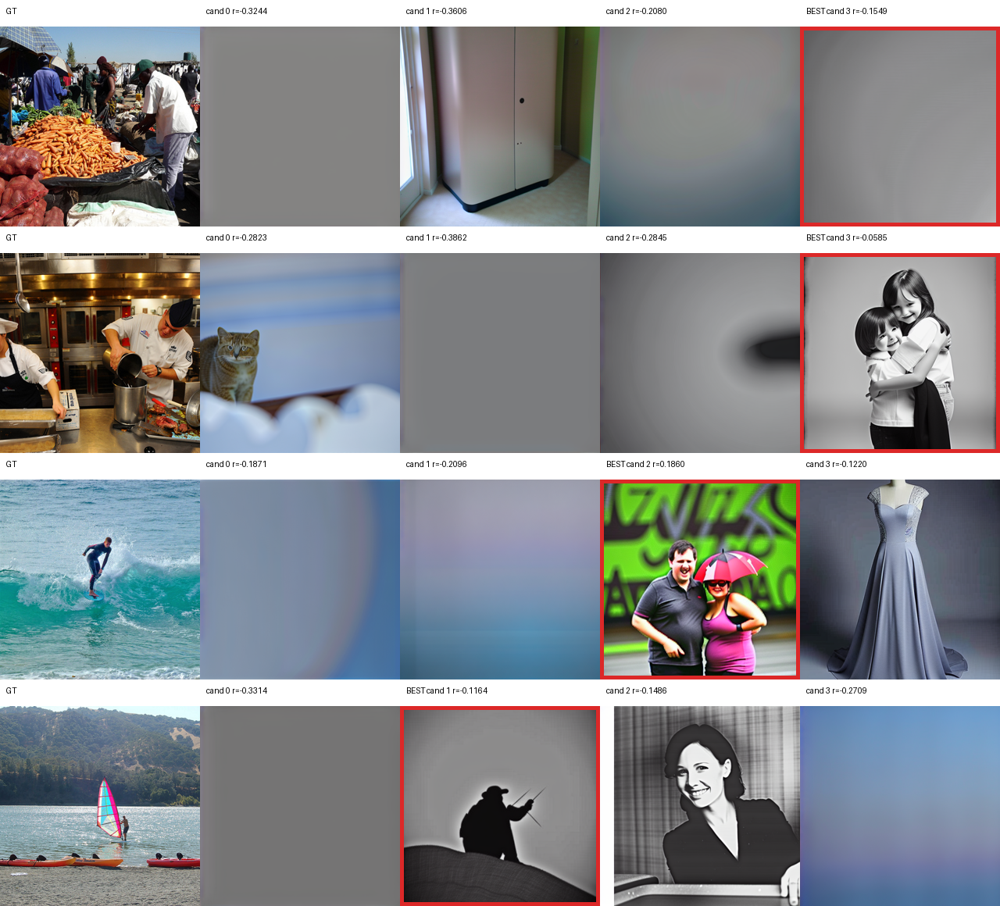
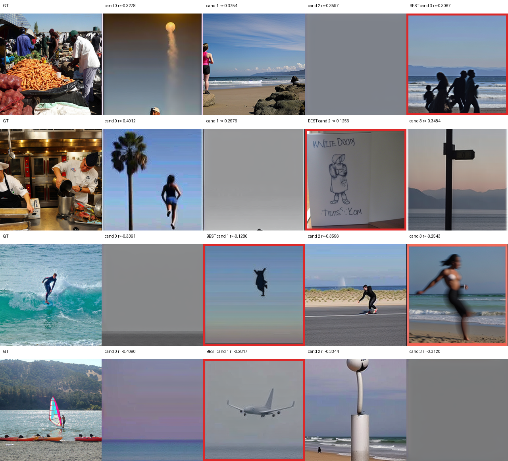

# NeuroAdapter 复现实验记录

本文件记录服务器 `/public/home/mty/GeYugong` 上 NeuroAdapter 复现的完整过程。大数据、模型权重和训练输出不进入 Git，只记录路径、配置、结果和问题。

## 环境与代码

- 服务器账号：`mty`
- 工作区：`/public/home/mty/GeYugong`
- 作者代码：`/public/home/mty/GeYugong/code/NeuroAdapter`
- 复现仓库：`/public/home/mty/GeYugong/neuroadapter-repro`
- Conda 环境：`neuroadapter`
- GPU：6 x NVIDIA A40，每张约 46GB 显存
- 已确认 fake model 测试可运行：`brain_adapter/model.py`

## 2026-07-05 数据准备

### NSD subject 1 下载

脚本：`scripts/download_nsd_subj01.sh`

原始数据位置：

```text
/public/home/mty/GeYugong/data/nsd
```

下载内容：

- `nsd_stimuli.hdf5`
- `nsd_expdesign.mat`
- `nsd_stim_info_merged.csv`
- `nsd_stim_info_merged.pkl`
- `subj01/fsaverage/betas_fithrf_GLMdenoise_RR` 下左右脑 40 个 session 的 `.mgh`

结果：下载完成，原始数据约 `74G`。

### NeuroAdapter 数据格式转换

脚本：`scripts/prepare_nsd_subj01.py`

输出位置：

```text
/public/home/mty/GeYugong/data/neuroadapter/neural_data
```

生成文件：

- `metadata_sub-01.npy`
- `betas_sub-01.h5`

结果：转换完成，NeuroAdapter neural data 约 `37G`。

### Schaefer parcel 标签

脚本：`scripts/generate_schaefer_labels.py`

来源：ThomasYeoLab/CBIG 的 `Schaefer2018_1000Parcels_7Networks_order.annot`，FreeSurfer `fsaverage`。

输出位置：

```text
/public/home/mty/GeYugong/data/neuroadapter/parcels/schaefer
```

生成文件：

- `lh_labels_s01.pt`
- `rh_labels_s01.pt`

验证结果：

```text
lh: 501 个标签，覆盖 163842 个顶点
rh: 501 个标签，覆盖 163842 个顶点
```

其中第 0 个标签是 medial wall，NeuroAdapter 的 dataset 会跳过它，所以每个半球有效 parcel 数为 500。

## 2026-07-05 数据读取验证

测试内容：真实 NSD subject 1 dataloader。

配置：

- split: `test`
- topk: `100`
- subject: `1`

结果：

```text
test set 长度: 1000
num_parcels: 200
max_voxels: 626
img_encoder:   (3, 425, 425)
img_ipadapter: (3, 512, 512)
brain_lh_f:    (100, 626)
brain_rh_f:    (100, 626)
```

结论：数据读取链路可用。

## 2026-07-05 Smoke Train

脚本：`scripts/smoke_train_step.py`

目的：验证真实数据能否完成一次训练步，不代表论文复现指标。

配置：

- subject: `1`
- topk: `4`
- batch size: `1`
- mixed precision: `no`
- GPU: `cuda`

结果：

```text
smoke_train_step ok
loss 0.053140923380851746
num_parcels 8
max_voxels 440
img_ipadapter (1, 3, 512, 512)
brain_lh_f (1, 4, 440)
brain_rh_f (1, 4, 440)
device cuda
```

问题与处理：

- 作者代码 `train_brain_adapter.py` 导入了 `nsd_groupwise_topk_parcel_dataset`，但当前 `dataset.py` 中没有该符号。smoke 脚本中为单被试训练做了兼容补丁。
- 服务器存在失效代理 `127.0.0.1:17891`，运行 Hugging Face/Diffusers 相关命令时需要 unset proxy。
- `fp16` 下遇到 `Attempting to unscale FP16 gradients`，smoke 测试改用 FP32，即 `mixed_precision=no`。

结论：真实 NSD 数据 -> dataloader -> Stable Diffusion -> NeuroAdapter -> loss -> backward -> optimizer step 已跑通。

## 2026-07-05 Limited Train Run 1

脚本：`scripts/train_limited.py`

计划配置：

- subject: `1`
- topk: `100`
- batch size: `1`
- max steps: `50`
- mixed precision: `no`
- GPU: `CUDA_VISIBLE_DEVICES=0`
- 输出目录：`/public/home/mty/GeYugong/outputs/neuroadapter/<run-name>`

状态：已完成。

运行结果：

```text
run name: 20260705-topk100-bs1-steps50
dataset_len: 9000
num_parcels: 200
max_voxels: 626
device: cuda
torch: 2.4.1+cu121
耗时: 58.41 秒
first_loss: 0.049765344709157944
last_loss: 0.0046898601576685905
min_loss: 0.0026548015885055065
max_loss: 0.4162288308143616
```

输出目录：

```text
/public/home/mty/GeYugong/outputs/neuroadapter/20260705-topk100-bs1-steps50
```

生成文件：

```text
config.json
losses.csv
summary.json
checkpoint-step-0025.pt
checkpoint-step-0050.pt
```

checkpoint：

```text
/public/home/mty/GeYugong/outputs/neuroadapter/20260705-topk100-bs1-steps50/checkpoint-step-0050.pt
```

是否 OOM/报错：无。

结论：`topk=100`、`batch_size=1` 的真实训练可以跑通；显存约 8.3GB，速度约 1 step/s。50 step 只是链路和稳定性验证，不代表论文指标。

## 2026-07-05 Limited Train Run 2

脚本：`scripts/train_limited.py`

配置：

- subject: `1`
- topk: `100`
- batch size: `1`
- max steps: `500`
- mixed precision: `no`
- GPU: `CUDA_VISIBLE_DEVICES=0`
- save every: `100`

运行结果：

```text
run name: 20260705-topk100-bs1-steps500
dataset_len: 9000
num_parcels: 200
max_voxels: 626
device: cuda
torch: 2.4.1+cu121
耗时: 422.43 秒
first_loss: 0.049765344709157944
last_loss: 0.08804396539926529
min_loss: 0.00226954510435462
max_loss: 0.4880872070789337
显存: 约 8.5GB
``` 

输出目录：

```text
/public/home/mty/GeYugong/outputs/neuroadapter/20260705-topk100-bs1-steps500
```

生成文件：

```text
config.json
losses.csv
summary.json
checkpoint-step-0100.pt
checkpoint-step-0200.pt
checkpoint-step-0300.pt
checkpoint-step-0400.pt
checkpoint-step-0500.pt
```

最终 checkpoint：

```text
/public/home/mty/GeYugong/outputs/neuroadapter/20260705-topk100-bs1-steps500/checkpoint-step-0500.pt
```

是否 OOM/报错：无。

结论：`topk=100`、`batch_size=1` 训练 500 steps 稳定完成，速度约 `1.18 step/s`。loss 有波动，500 steps 仍然只是小规模稳定性验证，不代表论文复现效果。

## 2026-07-05 Decode Smoke Test 1

脚本：`scripts/decode_limited.py`

目的：验证训练出的 checkpoint 能否加载，并从 test fMRI 生成图片。此实验不做 brain encoder 候选排序，也不代表论文指标。

配置：

- checkpoint: `/public/home/mty/GeYugong/outputs/neuroadapter/20260705-topk100-bs1-steps500/checkpoint-step-0500.pt`
- checkpoint step: `500`
- subject: `1`
- topk: `100`
- test samples: `4`
- start index: `0`
- denoising steps: `20`
- noise factor: `4.0`
- num predictions: `1`
- mixed precision: `fp16`
- GPU: `CUDA_VISIBLE_DEVICES=0`

运行结果：

```text
run name: 20260705-steps500-decode4
耗时: 27.42 秒
输出 grid: /public/home/mty/GeYugong/outputs/neuroadapter_decode/20260705-steps500-decode4/grid_gt_pred.png
```

输出目录：

```text
/public/home/mty/GeYugong/outputs/neuroadapter_decode/20260705-steps500-decode4
```

生成文件：

```text
sample_0000_gt.png / sample_0000_pred.png / sample_0000_gt_pred.png
sample_0001_gt.png / sample_0001_pred.png / sample_0001_gt_pred.png
sample_0002_gt.png / sample_0002_pred.png / sample_0002_gt_pred.png
sample_0003_gt.png / sample_0003_pred.png / sample_0003_gt_pred.png
grid_gt_pred.png
summary.json
```

结果观察：生成流程成功，图片文件非空，拼图尺寸为 `512x1024`。右列预测图目前与左列 ground truth 没有明显语义对应，这符合预期，因为模型只训练了 500 steps，当前目标是打通 decode 链路而非得到论文级效果。


结论：checkpoint 加载、test fMRI 输入、Stable Diffusion 生成、图片保存链路已经跑通。

## 2026-07-05 Batch Size 4 Stability Test

脚本：`scripts/train_limited.py`

目的：测试 `batch_size=4` 是否能在单张 A40 上稳定训练，为后续更长训练选择 batch size。

配置：

- subject: `1`
- topk: `100`
- batch size: `4`
- max steps: `50`
- mixed precision: `no`
- GPU: `CUDA_VISIBLE_DEVICES=0`
- save every: `50`

运行结果：

```text
run name: 20260705-topk100-bs4-steps50
dataset_len: 9000
num_parcels: 200
max_voxels: 626
device: cuda
torch: 2.4.1+cu121
耗时: 150.67 秒
first_loss: 0.15584427118301392
last_loss: 0.16647395491600037
min_loss: 0.015826208516955376
max_loss: 0.31141236424446106
显存: 约 16.5GB
```

输出目录：

```text
/public/home/mty/GeYugong/outputs/neuroadapter/20260705-topk100-bs4-steps50
```

结论：`batch_size=4` 不会 OOM，单步约 3 秒，样本吞吐略高于 `batch_size=1`。后续长训练可以使用 `batch_size=4`，但需要支持从已有 checkpoint 继续训练，避免重复从零开始。

## 2026-07-05 Resume Train Run 3

脚本：`scripts/train_limited.py`

目的：从已有 `step 500` checkpoint 继续训练，而不是从随机初始化重新开始。

配置：

- init checkpoint: `/public/home/mty/GeYugong/outputs/neuroadapter/20260705-topk100-bs1-steps500/checkpoint-step-0500.pt`
- initial step: `500`
- additional steps: `1750`
- final step: `2250`
- subject: `1`
- topk: `100`
- batch size: `4`
- mixed precision: `no`
- GPU: `CUDA_VISIBLE_DEVICES=0`
- save every: `500` additional steps

运行结果：

```text
run name: 20260705-topk100-bs4-resume500-add1750
dataset_len: 9000
num_parcels: 200
max_voxels: 626
device: cuda
torch: 2.4.1+cu121
耗时: 2798.44 秒
first_loss: 0.14795000851154327
last_loss: 0.041569337248802185
min_loss: 0.007006385363638401
max_loss: 0.3056139349937439
显存: 约 16.5GB
```

输出目录：

```text
/public/home/mty/GeYugong/outputs/neuroadapter/20260705-topk100-bs4-resume500-add1750
```

生成文件：

```text
config.json
losses.csv
summary.json
checkpoint-step-1000.pt
checkpoint-step-1500.pt
checkpoint-step-2000.pt
checkpoint-step-2250.pt
```

最终 checkpoint：

```text
/public/home/mty/GeYugong/outputs/neuroadapter/20260705-topk100-bs4-resume500-add1750/checkpoint-step-2250.pt
```

是否 OOM/报错：无。

结论：从 `step 500` 继续训练到 `step 2250` 成功，说明 checkpoint resume 链路可用。该训练仍远少于论文完整训练，但已经比 500 step 更接近可观察 decode 效果的阶段。

## 2026-07-05 Decode Smoke Test 2

脚本：`scripts/decode_limited.py`

目的：使用续训到 `step 2250` 的 checkpoint 再做一次 decode，对比 `step 500` 的小样本生成效果。

配置：

- checkpoint: `/public/home/mty/GeYugong/outputs/neuroadapter/20260705-topk100-bs4-resume500-add1750/checkpoint-step-2250.pt`
- checkpoint step: `2250`
- subject: `1`
- topk: `100`
- test samples: `4`
- start index: `0`
- denoising steps: `20`
- noise factor: `4.0`
- num predictions: `1`
- mixed precision: `fp16`
- GPU: `CUDA_VISIBLE_DEVICES=0`

运行结果：

```text
run name: 20260705-steps2250-decode4
耗时: 30.92 秒
输出 grid: /public/home/mty/GeYugong/outputs/neuroadapter_decode/20260705-steps2250-decode4/grid_gt_pred.png
```



输出目录：

```text
/public/home/mty/GeYugong/outputs/neuroadapter_decode/20260705-steps2250-decode4
```

结果观察：decode 链路继续可用，但生成图仍没有形成稳定的 brain-to-image 对应。右列大多是低细节背景或随机视觉元素，不能视为有效复现结果。相比 step 500，step 2250 的输出仍未显示可靠语义对齐。

结论：训练和 decode 已经可以持续跑，但当前训练步数和简化 decode 流程仍不足以得到论文效果。下一步应考虑更长训练、使用更多 denoising steps/候选图，并补齐作者的 brain encoder candidate selection 评估流程。

## 2026-07-05 Alignment and Decode Diagnosis

目的：排查“训练和 decode 都能跑，但生成图不对”的主要原因。

### 数据和 trial 顺序检查

检查脚本：临时脚本 `/public/home/mty/GeYugong/tmp/check_alignment.py`

结果：

```text
metadata img_presentation_order == nsd_expdesign.mat 推导结果: True
first10 meta:     [46002, 61882, 828, 67573, 16020, 40422, 51517, 62325, 50610, 55065]
first10 expected: [46002, 61882, 828, 67573, 16020, 40422, 51517, 62325, 50610, 55065]
train/test/val: 9000 / 1000 / 0
presented unique images: 10000
trials: 30000
test images in subject image set: 1000 / 1000
train-test overlap: 0
lh_betas shape: (30000, 163842), dtype float32, no NaN in checked block
rh_betas shape: (30000, 163842), dtype float32, no NaN in checked block
```

结论：目前没有发现图像 trial 顺序错位或 train/test 划分错误。

### Parcel 一致性检查

检查脚本：临时脚本 `/public/home/mty/GeYugong/tmp/check_checkpoint_dataset.py`

结果：

```text
train split top-k parcel 与 checkpoint 保存的 selected_parcel_idx 一致: True
test split top-k parcel 与 checkpoint 保存的 selected_parcel_idx 一致: True
num_parcels: 200
max_voxels: 626
```

结论：训练和 decode 使用的是同一套 top-k parcel，不是 parcel 选择不一致导致的问题。

### Decode 参数检查：50 denoising steps

脚本：`scripts/decode_limited.py`

配置：

- checkpoint: `/public/home/mty/GeYugong/outputs/neuroadapter/20260705-topk100-bs4-resume500-add1750/checkpoint-step-2250.pt`
- checkpoint step: `2250`
- test samples: `4`
- denoising steps: `50`
- noise factor: `4.0`
- num predictions: `1`

运行结果：

```text
run name: 20260705-steps2250-decode4-denoise50
耗时: 30.24 秒
```


观察：50 denoising steps 的图片更像正常 Stable Diffusion 输出，但仍没有和 ground truth 建立对应关系。说明主要问题不是 20 steps 采样过少。

### 当前判断

目前更可能的原因：

1. 训练量仍远不足。当前约 2250 optimizer steps，batch size 4，相当于约 1 个 epoch；作者 README 示例是 100 epochs，论文实验更长。
2. 当前 decode 是简化版，每个样本只生成 1 张，没有接入作者的 brain encoder candidate selection。
3. 当前训练没有完全复用作者 Accelerate checkpoint 流程，但核心模型、loss、dataset、IP-Adapter 注入路径一致。
4. 若继续追求效果，应优先跑更长训练，并补齐作者 brain encoder 评估/筛选流程，而不是只看单张随机 decode。

## 2026-07-05 Brain Encoder Candidate Selection Smoke

目的：补上论文/作者代码里的候选图选择环节。之前的 `decode_limited.py` 只生成第一张候选图；这次每个测试样本生成 4 张候选图，再用 `whole_brain_encoder` 的最小权重组合 `dinov2_q enc_1/run_1` 对候选图预测 fMRI，并和真实 subject 1 的 top-k parcel fMRI 计算 Pearson correlation，选分数最高的候选。

外部依赖处理：
- 下载 `whole_brain_encoder` 到 `/public/home/mty/GeYugong/tools/whole_brain_encoder`。
- 只下载 subject 1、`enc_1/run_1` 的左右脑权重，避免一次拉完整 11GB+。
- 下载 DINOv2 torch hub 代码到 `/public/home/mty/GeYugong/tools/torch_hub/facebookresearch_dinov2_main`，并把 `whole_brain_encoder/models/dino.py` 中作者机器上的硬编码路径改成本机路径。
- conda 环境会自动设置失效代理，运行时需要在 `conda activate neuroadapter` 后再 `unset http_proxy https_proxy HTTP_PROXY HTTPS_PROXY ALL_PROXY all_proxy`，并设置 `HF_HUB_OFFLINE=1 TRANSFORMERS_OFFLINE=1 DIFFUSERS_OFFLINE=1` 使用本地缓存。

命令：

```bash
python /public/home/mty/GeYugong/neuroadapter-repro/scripts/decode_brain_encoder_select.py \
  --checkpoint /public/home/mty/GeYugong/outputs/neuroadapter/20260705-topk100-bs4-resume500-add1750/checkpoint-step-2250.pt \
  --run-name 20260705-steps2250-be-select4-cand4-denoise20 \
  --num-samples 4 \
  --num-predictions 4 \
  --denoising-steps 20 \
  --topk 100
```

结果：
- 输出目录：`/public/home/mty/GeYugong/outputs/neuroadapter_decode/20260705-steps2250-be-select4-cand4-denoise20`
- 总耗时：40.12 秒
- checkpoint step：2250
- 每个样本生成 4 张候选图，并保存 `summary.json`、每个样本的候选图、GT 和 selection grid。
- best candidate：sample 0 -> cand 3；sample 1 -> cand 3；sample 2 -> cand 2；sample 3 -> cand 1。
- 注意：这只是最小 brain encoder selection smoke，不是作者完整设置。作者完整评估通常会用更多 encoder layers/runs、更多候选图、更充分训练的 NeuroAdapter checkpoint。当前分数仍然整体偏低，说明 2250 step 小训练还远不足以复现论文效果。



## 2026-07-05 Resume Training To 10000 Started

目的：从 `checkpoint-step-2250.pt` 继续训练到全局 `10000 step`，作为下一轮 decode 和 brain encoder candidate selection 的输入。

输出目录：

`/public/home/mty/GeYugong/outputs/neuroadapter/20260705-topk100-bs4-resume2250-to10000`

启动命令等价于：

```bash
CUDA_VISIBLE_DEVICES=0 \
HF_HUB_OFFLINE=1 TRANSFORMERS_OFFLINE=1 DIFFUSERS_OFFLINE=1 \
PYTHONPATH=/public/home/mty/GeYugong/code/NeuroAdapter:$PYTHONPATH \
python /public/home/mty/GeYugong/neuroadapter-repro/scripts/train_limited.py \
  --run-name 20260705-topk100-bs4-resume2250-to10000 \
  --init-checkpoint /public/home/mty/GeYugong/outputs/neuroadapter/20260705-topk100-bs4-resume500-add1750/checkpoint-step-2250.pt \
  --max-steps 7750 \
  --topk 100 \
  --batch-size 4 \
  --mixed-precision no \
  --save-every 1000
```

启动排查记录：
- 第一次后台启动失败：没有设置 `PYTHONPATH`，`train_limited.py` 找不到 `brain_adapter`。失败日志保存在 `train.failed-import.log`。
- 第二次后台启动失败：使用 `--mixed-precision fp16` 时，Accelerate 在梯度裁剪阶段报 `Attempting to unscale FP16 gradients`。失败日志保存在 `train.failed-fp16.log`。
- 第三次使用 `--mixed-precision no` 正常开始训练。PID：`55159`。

当前已确认：
- 从 step 2250 checkpoint 成功 resume。
- GPU0 显存占用约 16.5GB。
- `losses.csv` 已写入 step 2251 起的 loss。
- 目标 final checkpoint 应为 `checkpoint-step-10000.pt`。

后续动作：等训练完成后，检查 `summary.json`、`losses.csv` 和 `checkpoint-step-10000.pt`，然后用 brain encoder candidate selection 对 10000 step checkpoint 解码。

## 2026-07-05 Resume Training To 10000 Completed

训练已完成。

输出目录：

`/public/home/mty/GeYugong/outputs/neuroadapter/20260705-topk100-bs4-resume2250-to10000`

关键结果：
- initial step：2250
- additional steps：7750
- final step：10000
- final checkpoint：`/public/home/mty/GeYugong/outputs/neuroadapter/20260705-topk100-bs4-resume2250-to10000/checkpoint-step-10000.pt`
- elapsed：8884.94 秒，约 2.47 小时
- first loss：0.1460009813
- last loss：0.1143550575
- min loss：0.0045559588
- max loss：0.3352905512

保存的中间 checkpoint：
- `checkpoint-step-3250.pt`
- `checkpoint-step-4250.pt`
- `checkpoint-step-5250.pt`
- `checkpoint-step-6250.pt`
- `checkpoint-step-7250.pt`
- `checkpoint-step-8250.pt`
- `checkpoint-step-9250.pt`
- `checkpoint-step-10000.pt`

结论：10000 step 训练产物完整，下一步使用 `checkpoint-step-10000.pt` 进行 decode 和 brain encoder candidate selection。

## 2026-07-06 Decode 10000 With Brain Encoder Selection

目的：用 `checkpoint-step-10000.pt` 跑与 2250 step 相同设置的候选图解码，比较训练更久之后的图像变化。

命令：

```bash
python /public/home/mty/GeYugong/neuroadapter-repro/scripts/decode_brain_encoder_select.py \
  --checkpoint /public/home/mty/GeYugong/outputs/neuroadapter/20260705-topk100-bs4-resume2250-to10000/checkpoint-step-10000.pt \
  --run-name 20260706-steps10000-be-select4-cand4-denoise20 \
  --num-samples 4 \
  --num-predictions 4 \
  --denoising-steps 20 \
  --topk 100
```

结果：
- 输出目录：`/public/home/mty/GeYugong/outputs/neuroadapter_decode/20260706-steps10000-be-select4-cand4-denoise20`
- checkpoint step：10000
- num samples：4
- candidates per sample：4
- denoising steps：20
- elapsed：37.30 秒
- best candidate：sample 0 -> cand 3；sample 1 -> cand 2；sample 2 -> cand 1；sample 3 -> cand 1。

观察：
- 相比 2250 step，小规模 10000 step 输出更常出现完整自然图像，而不是大面积灰图或模糊块。
- 但图像内容仍没有稳定对应 ground truth，brain encoder score 多数仍为负。
- 结论：训练到 10000 step 后生成质量有改善迹象，但目前仍只是小规模复现流程验证，不是论文级复现效果。下一步若继续追求结果，应扩大训练步数、候选图数量，并补齐更多 brain encoder layers/runs。



## 2026-07-06 Decode 10000 With Larger Candidate Set

目的：用 `checkpoint-step-10000.pt` 跑更可靠的小规模解码检查。相比上一版 `4 samples x 4 candidates x 20 denoising steps`，这次扩大为 `8 samples x 8 candidates x 50 denoising steps`。

命令：

```bash
python /public/home/mty/GeYugong/neuroadapter-repro/scripts/decode_brain_encoder_select.py \
  --checkpoint /public/home/mty/GeYugong/outputs/neuroadapter/20260705-topk100-bs4-resume2250-to10000/checkpoint-step-10000.pt \
  --run-name 20260706-steps10000-be-select8-cand8-denoise50 \
  --num-samples 8 \
  --num-predictions 8 \
  --denoising-steps 50 \
  --topk 100
```

结果：
- 输出目录：`/public/home/mty/GeYugong/outputs/neuroadapter_decode/20260706-steps10000-be-select8-cand8-denoise50`
- checkpoint step：10000
- num samples：8
- candidates per sample：8
- denoising steps：50
- elapsed：145.62 秒
- best candidate index：`[0, 5, 6, 5, 0, 2, 0, 6]`
- best candidate mean scores：`[0.0439, -0.0591, -0.0385, -0.0988, 0.2535, 0.1851, 0.1446, 0.1361]`

观察：
- 8 个样本中有 5 个 best score 为正，比上一版 `4x4x20` 更能说明 brain encoder selection 在候选集里确实能挑出相对更匹配的图。
- 图像自然性明显比 2250 step 好，也比 20 denoising steps 更完整。
- 但大多数样本的语义仍没有稳定对应 GT。例如菜市场、厨房、食物、运动场景等还经常被选成室内、海边、人物、文字牌等无关内容。
- 结论：`10000 step + 8 candidates + 50 denoising steps` 是当前最可靠的小规模流程验证；它证明生成和筛选链路已经可用，但还不足以复现论文级 brain-to-image 效果。

下一步判断：
- 如果目标是“给师兄证明我跑通了”，当前已经足够作为阶段性结果。
- 如果目标是“继续追论文效果”，优先继续训练到 20000/30000 step，再用同一套 `8x8x50` 对比。


## 2026-07-06 Resume Training To 20000 Started

目的：继续追踪训练步数是否带来更好的 brain-to-image 解码效果。从 `checkpoint-step-10000.pt` 续训到全局 `20000 step`。

输出目录：

`/public/home/mty/GeYugong/outputs/neuroadapter/20260706-topk100-bs4-resume10000-to20000`

启动命令等价于：

```bash
CUDA_VISIBLE_DEVICES=0 \
HF_HUB_OFFLINE=1 TRANSFORMERS_OFFLINE=1 DIFFUSERS_OFFLINE=1 \
PYTHONPATH=/public/home/mty/GeYugong/code/NeuroAdapter:$PYTHONPATH \
python /public/home/mty/GeYugong/neuroadapter-repro/scripts/train_limited.py \
  --run-name 20260706-topk100-bs4-resume10000-to20000 \
  --init-checkpoint /public/home/mty/GeYugong/outputs/neuroadapter/20260705-topk100-bs4-resume2250-to10000/checkpoint-step-10000.pt \
  --max-steps 10000 \
  --topk 100 \
  --batch-size 4 \
  --mixed-precision no \
  --save-every 1000
```

启动状态：
- PID：`59767`
- 从 step 10000 继续，目标 final checkpoint 为 `checkpoint-step-20000.pt`。
- 运行完成后继续使用同一套 `8 samples x 8 candidates x 50 denoising steps` 解码对比。

## 2026-07-06 Switch 20000 Training To 2-GPU DDP

目的：用户希望直接用多卡加速 10000 -> 20000 的续训。

处理过程：
- 检查发现原 `train_limited.py` 虽然模型和 optimizer 使用了 `accelerator.prepare`，但 dataloader 没有进入 `accelerator.prepare`，且日志/checkpoint 没有主进程保护。
- 已修改 `scripts/train_limited.py`：
  - `train_dataloader = accelerator.prepare(train_dataloader)`
  - 仅 `accelerator.is_main_process` 写 `config.json`、`losses.csv`、checkpoint、`summary.json`
  - checkpoint 前后使用 `accelerator.wait_for_everyone()`
  - loss 使用 `accelerator.reduce(..., reduction="mean")` 记录跨进程平均值
- 先在 GPU1/2 上跑 `20260706-ddp-smoke-2gpu-2steps`，2 step smoke test 成功，能保存 checkpoint 和 summary。
- 第一次正式启动只加了 `--num_processes 2`，没有真正多卡；已停止，日志保存在 `train.fake-ddp.log` / `losses.fake-ddp.csv`。
- 当前正式使用：
  `accelerate launch --multi_gpu --num_processes 2`

当前正式 run：

`/public/home/mty/GeYugong/outputs/neuroadapter/20260706-topk100-bs4-ddp2-resume10000-to20000`

状态确认：
- launcher PID：`61860`
- worker：2 个 `train_limited.py` 进程
- GPU0/GPU1 各占约 16.5GB，利用率 100%
- `losses.csv` 已正常写入，从 step 10001 开始
- 目标 checkpoint：`checkpoint-step-20000.pt`

注意：
- 当前 DDP 每张卡 batch size 4，因此有效 global batch size 是 8，和之前单卡 batch size 4 不完全等价。
- 学习率暂时保持 `1e-4`，这是为了减少变量，只先观察继续训练是否改善 decode。

## 2026-07-06 Project Directory Layout

发现问题：`/public/home/mty/GeYugong` 是个人工作区根目录，不应该长期把某个论文项目的 `code/data/outputs/tools/repro` 全部平铺在这里。后续如果继续做别的论文或实验，会混乱。

处理：
- 新建统一项目入口：`/public/home/mty/GeYugong/projects/neuroadapter-iclr2026`
- 当前为了不打断正在运行的 20000 step 训练，先使用 symlink 指向已有真实目录，不移动真实文件。

当前统一入口结构：

```text
/public/home/mty/GeYugong/projects/neuroadapter-iclr2026
├── code        -> ../../code/NeuroAdapter
├── repro       -> ../../neuroadapter-repro
├── data        -> ../../data
├── outputs     -> ../../outputs
├── checkpoints -> ../../checkpoints
├── tools       -> ../../tools
└── logs        -> ../../logs
```

注意：
- 训练还在使用旧绝对路径，训练结束前不要移动真实目录。
- 后续更推荐 VS Code 打开：`/public/home/mty/GeYugong/projects/neuroadapter-iclr2026/repro` 或直接打开项目入口目录。
- 如果训练结束后要做彻底整理，可以把真实目录迁移进 `projects/neuroadapter-iclr2026/`，并在旧路径保留 symlink 兼容已有脚本。

## 2026-07-06 Resume Training To 20000 Completed

训练已完成。

输出目录：

`/public/home/mty/GeYugong/outputs/neuroadapter/20260706-topk100-bs4-ddp2-resume10000-to20000`

关键结果：
- initial step：10000
- additional steps：10000
- final step：20000
- final checkpoint：`/public/home/mty/GeYugong/outputs/neuroadapter/20260706-topk100-bs4-ddp2-resume10000-to20000/checkpoint-step-20000.pt`
- elapsed：10973.29 秒，约 3.05 小时
- last loss：0.1865352988
- 训练进程已结束，GPU 已释放。

保存的中间 checkpoint：
- `checkpoint-step-11000.pt`
- `checkpoint-step-12000.pt`
- `checkpoint-step-13000.pt`
- `checkpoint-step-14000.pt`
- `checkpoint-step-15000.pt`
- `checkpoint-step-16000.pt`
- `checkpoint-step-17000.pt`
- `checkpoint-step-18000.pt`
- `checkpoint-step-19000.pt`
- `checkpoint-step-20000.pt`

结论：20000 step 训练产物完整。下一步使用 `checkpoint-step-20000.pt` 跑同一套 `8 samples x 8 candidates x 50 denoising steps` 解码，与 10000 step 结果对比。

## 2026-07-06 Project Directory Migration Completed

训练结束后，已完成真实目录迁移。此前 `projects/neuroadapter-iclr2026` 只是 symlink 统一入口；现在 NeuroAdapter 项目相关真实目录已经收进项目容器。

当前真实项目目录：

```text
/public/home/mty/GeYugong/projects/neuroadapter-iclr2026
├── code/NeuroAdapter
├── repro
├── data
├── outputs
├── checkpoints
├── tools/whole_brain_encoder
├── tools/torch_hub
└── logs
```

为了兼容历史脚本中的绝对路径，旧路径保留为 symlink：

```text
/public/home/mty/GeYugong/code/NeuroAdapter
/public/home/mty/GeYugong/neuroadapter-repro
/public/home/mty/GeYugong/data
/public/home/mty/GeYugong/outputs
/public/home/mty/GeYugong/checkpoints
/public/home/mty/GeYugong/logs
/public/home/mty/GeYugong/tools/whole_brain_encoder
/public/home/mty/GeYugong/tools/torch_hub
```

说明：
- 没有迁移通用 Codex 工具目录，例如 `tools/codex*`，它们不是本论文项目内容。
- 推荐 VS Code 打开 `/public/home/mty/GeYugong/projects/neuroadapter-iclr2026/repro`。

## 2026-07-06 Decode 20000 With Larger Candidate Set

使用 20000 step checkpoint 跑同一套较大的候选解码：

```text
checkpoint: /public/home/mty/GeYugong/projects/neuroadapter-iclr2026/outputs/neuroadapter/20260706-topk100-bs4-ddp2-resume10000-to20000/checkpoint-step-20000.pt
run: 20260706-steps20000-be-select8-cand8-denoise50
samples: 8
candidates per sample: 8
denoising steps: 50
topk: 100
selection metric: whole_brain_encoder dinov2_q enc_1 run_1 lh/rh mean score
```

输出目录：

`/public/home/mty/GeYugong/projects/neuroadapter-iclr2026/outputs/neuroadapter_decode/20260706-steps20000-be-select8-cand8-denoise50`

已保存总览图：


结果摘要：
- elapsed：162.23 秒
- best candidate indices：`[2, 1, 2, 2, 3, 6, 6, 0]`
- best candidate mean scores：`[0.3461, 0.1617, -0.1100, 0.1910, 0.4118, 0.5151, 0.4691, 0.1915]`
- 8 个样本中 7 个 best score 为正。

和 10000 step 的同设置结果相比，20000 step 的 brain encoder 选择分数更稳定：10000 step 是 8 个样本中 5 个 best score 为正，20000 step 是 7 个为正。不过这仍然不是论文级复现，当前只是小样本 smoke / sanity check：重建图像依然明显受 Stable Diffusion 先验影响，部分样本语义与 GT 偏差很大，例如市场图像生成成室内/建筑，冲浪图像生成成鸟或运动人物。
