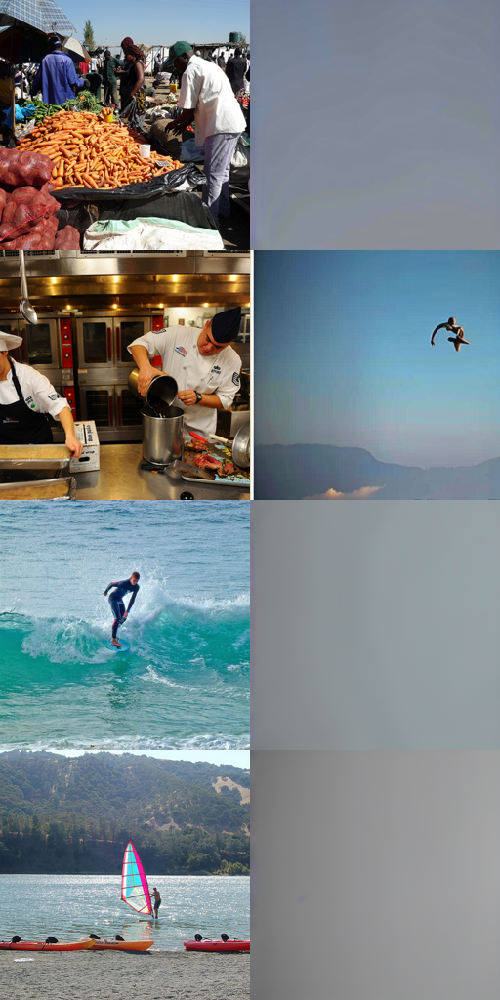
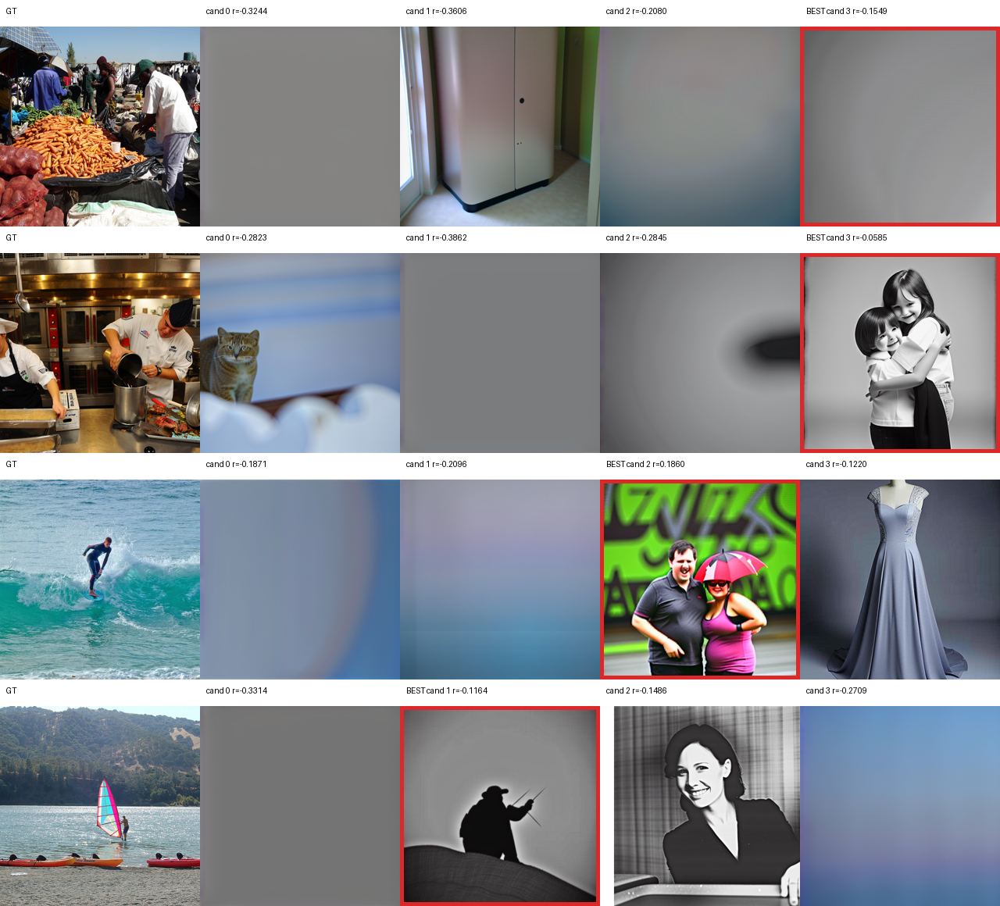
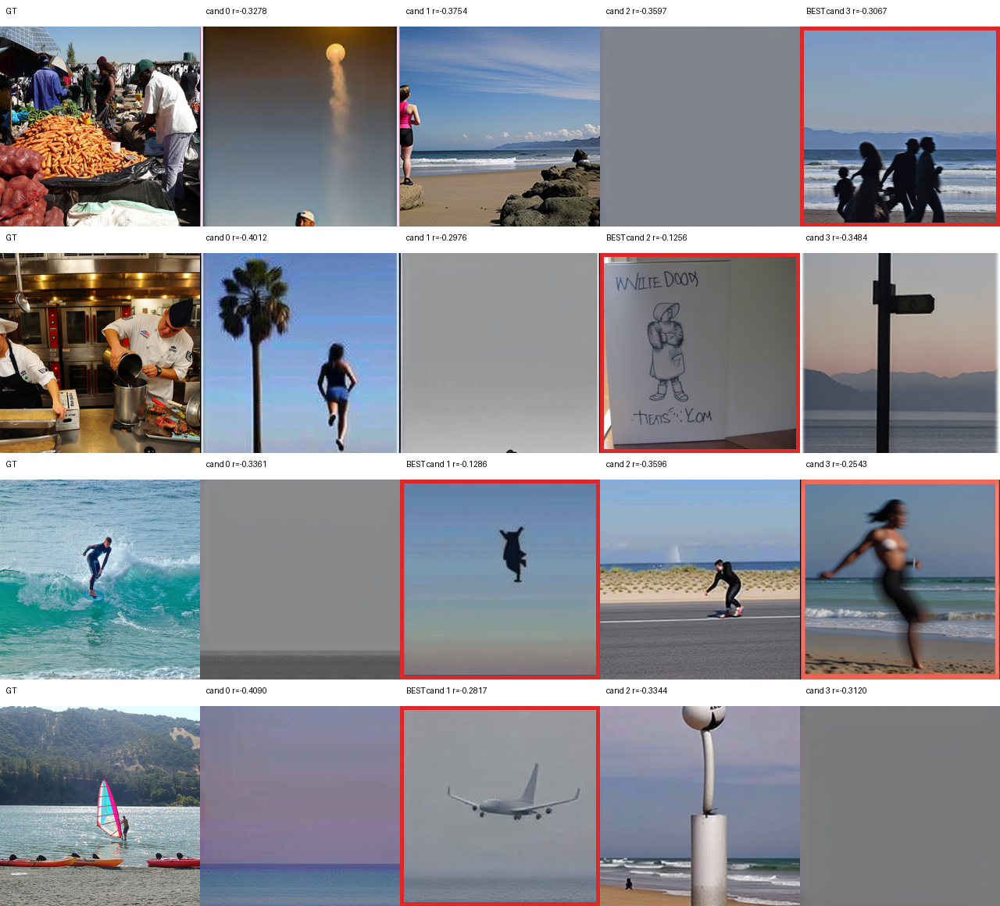

# NeuroAdapter 复现实验记录

本文件记录服务器 `/public/home/mty/GeYugong` 上 NeuroAdapter 复现的完整过程。大数据、模型权重和训练输出不进入 Git，只记录路径、配置、结果和问题。

## 日志制度

- 本文件是项目唯一的连续主日志，按实际发生时间向末尾追加，不能覆盖或
  删除已有历史记录。
- 每次开发、测试、训练、解码和评估均记录：工作内容、配置与命令、
  commit、数据/checkpoint/输出路径、GPU 使用情况、运行时长、测试与指标、
  图片位置、问题处理、当前结论和下一步。
- `docs/CURRENT_STATE.md` 只保存最新状态快照。
- `docs/DECISIONS.md` 只保存关键科研决策及其依据。
- 各实验目录中的 README 只解释该目录产物，不能替代本日志。

## 环境与代码

- 服务器账号：`mty`
- 工作区：`/public/home/mty/GeYugong`
- 作者代码：`/public/home/mty/GeYugong/code/NeuroAdapter`
- 复现仓库：`/public/home/mty/GeYugong/neuroadapter-repro`
- Conda 环境：`neuroadapter`
- GPU：6 x NVIDIA A40，每张约 46GB 显存
- 已确认 fake model 测试可运行：`brain_adapter/model.py`

## 2026-07-05 数据准备

### NSD subject 1 下载

脚本：`scripts/download_nsd_subj01.sh`

原始数据位置：

```text
/public/home/mty/GeYugong/data/nsd
```

下载内容：

- `nsd_stimuli.hdf5`
- `nsd_expdesign.mat`
- `nsd_stim_info_merged.csv`
- `nsd_stim_info_merged.pkl`
- `subj01/fsaverage/betas_fithrf_GLMdenoise_RR` 下左右脑 40 个 session 的 `.mgh`

结果：下载完成，原始数据约 `74G`。

### NeuroAdapter 数据格式转换

脚本：`scripts/prepare_nsd_subj01.py`

输出位置：

```text
/public/home/mty/GeYugong/data/neuroadapter/neural_data
```

生成文件：

- `metadata_sub-01.npy`
- `betas_sub-01.h5`

结果：转换完成，NeuroAdapter neural data 约 `37G`。

### Schaefer parcel 标签

脚本：`scripts/generate_schaefer_labels.py`

来源：ThomasYeoLab/CBIG 的 `Schaefer2018_1000Parcels_7Networks_order.annot`，FreeSurfer `fsaverage`。

输出位置：

```text
/public/home/mty/GeYugong/data/neuroadapter/parcels/schaefer
```

生成文件：

- `lh_labels_s01.pt`
- `rh_labels_s01.pt`

验证结果：

```text
lh: 501 个标签，覆盖 163842 个顶点
rh: 501 个标签，覆盖 163842 个顶点
```

其中第 0 个标签是 medial wall，NeuroAdapter 的 dataset 会跳过它，所以每个半球有效 parcel 数为 500。

## 2026-07-05 数据读取验证

测试内容：真实 NSD subject 1 dataloader。

配置：

- split: `test`
- topk: `100`
- subject: `1`

结果：

```text
test set 长度: 1000
num_parcels: 200
max_voxels: 626
img_encoder:   (3, 425, 425)
img_ipadapter: (3, 512, 512)
brain_lh_f:    (100, 626)
brain_rh_f:    (100, 626)
```

结论：数据读取链路可用。

## 2026-07-05 Smoke Train

脚本：`scripts/smoke_train_step.py`

目的：验证真实数据能否完成一次训练步，不代表论文复现指标。

配置：

- subject: `1`
- topk: `4`
- batch size: `1`
- mixed precision: `no`
- GPU: `cuda`

结果：

```text
smoke_train_step ok
loss 0.053140923380851746
num_parcels 8
max_voxels 440
img_ipadapter (1, 3, 512, 512)
brain_lh_f (1, 4, 440)
brain_rh_f (1, 4, 440)
device cuda
```

问题与处理：

- 作者代码 `train_brain_adapter.py` 导入了 `nsd_groupwise_topk_parcel_dataset`，但当前 `dataset.py` 中没有该符号。smoke 脚本中为单被试训练做了兼容补丁。
- 服务器存在失效代理 `127.0.0.1:17891`，运行 Hugging Face/Diffusers 相关命令时需要 unset proxy。
- `fp16` 下遇到 `Attempting to unscale FP16 gradients`，smoke 测试改用 FP32，即 `mixed_precision=no`。

结论：真实 NSD 数据 -> dataloader -> Stable Diffusion -> NeuroAdapter -> loss -> backward -> optimizer step 已跑通。

## 2026-07-05 Limited Train Run 1

脚本：`scripts/train_limited.py`

计划配置：

- subject: `1`
- topk: `100`
- batch size: `1`
- max steps: `50`
- mixed precision: `no`
- GPU: `CUDA_VISIBLE_DEVICES=0`
- 输出目录：`/public/home/mty/GeYugong/outputs/neuroadapter/<run-name>`

状态：已完成。

运行结果：

```text
run name: 20260705-topk100-bs1-steps50
dataset_len: 9000
num_parcels: 200
max_voxels: 626
device: cuda
torch: 2.4.1+cu121
耗时: 58.41 秒
first_loss: 0.049765344709157944
last_loss: 0.0046898601576685905
min_loss: 0.0026548015885055065
max_loss: 0.4162288308143616
```

输出目录：

```text
/public/home/mty/GeYugong/outputs/neuroadapter/20260705-topk100-bs1-steps50
```

生成文件：

```text
config.json
losses.csv
summary.json
checkpoint-step-0025.pt
checkpoint-step-0050.pt
```

checkpoint：

```text
/public/home/mty/GeYugong/outputs/neuroadapter/20260705-topk100-bs1-steps50/checkpoint-step-0050.pt
```

是否 OOM/报错：无。

结论：`topk=100`、`batch_size=1` 的真实训练可以跑通；显存约 8.3GB，速度约 1 step/s。50 step 只是链路和稳定性验证，不代表论文指标。

## 2026-07-05 Limited Train Run 2

脚本：`scripts/train_limited.py`

配置：

- subject: `1`
- topk: `100`
- batch size: `1`
- max steps: `500`
- mixed precision: `no`
- GPU: `CUDA_VISIBLE_DEVICES=0`
- save every: `100`

运行结果：

```text
run name: 20260705-topk100-bs1-steps500
dataset_len: 9000
num_parcels: 200
max_voxels: 626
device: cuda
torch: 2.4.1+cu121
耗时: 422.43 秒
first_loss: 0.049765344709157944
last_loss: 0.08804396539926529
min_loss: 0.00226954510435462
max_loss: 0.4880872070789337
显存: 约 8.5GB
``` 

输出目录：

```text
/public/home/mty/GeYugong/outputs/neuroadapter/20260705-topk100-bs1-steps500
```

生成文件：

```text
config.json
losses.csv
summary.json
checkpoint-step-0100.pt
checkpoint-step-0200.pt
checkpoint-step-0300.pt
checkpoint-step-0400.pt
checkpoint-step-0500.pt
```

最终 checkpoint：

```text
/public/home/mty/GeYugong/outputs/neuroadapter/20260705-topk100-bs1-steps500/checkpoint-step-0500.pt
```

是否 OOM/报错：无。

结论：`topk=100`、`batch_size=1` 训练 500 steps 稳定完成，速度约 `1.18 step/s`。loss 有波动，500 steps 仍然只是小规模稳定性验证，不代表论文复现效果。

## 2026-07-05 Decode Smoke Test 1

脚本：`scripts/decode_limited.py`

目的：验证训练出的 checkpoint 能否加载，并从 test fMRI 生成图片。此实验不做 brain encoder 候选排序，也不代表论文指标。

配置：

- checkpoint: `/public/home/mty/GeYugong/outputs/neuroadapter/20260705-topk100-bs1-steps500/checkpoint-step-0500.pt`
- checkpoint step: `500`
- subject: `1`
- topk: `100`
- test samples: `4`
- start index: `0`
- denoising steps: `20`
- noise factor: `4.0`
- num predictions: `1`
- mixed precision: `fp16`
- GPU: `CUDA_VISIBLE_DEVICES=0`

运行结果：

```text
run name: 20260705-steps500-decode4
耗时: 27.42 秒
输出 grid: /public/home/mty/GeYugong/outputs/neuroadapter_decode/20260705-steps500-decode4/grid_gt_pred.png
```

输出目录：

```text
/public/home/mty/GeYugong/outputs/neuroadapter_decode/20260705-steps500-decode4
```

生成文件：

```text
sample_0000_gt.png / sample_0000_pred.png / sample_0000_gt_pred.png
sample_0001_gt.png / sample_0001_pred.png / sample_0001_gt_pred.png
sample_0002_gt.png / sample_0002_pred.png / sample_0002_gt_pred.png
sample_0003_gt.png / sample_0003_pred.png / sample_0003_gt_pred.png
grid_gt_pred.png
summary.json
```

结果观察：生成流程成功，图片文件非空，拼图尺寸为 `512x1024`。右列预测图目前与左列 ground truth 没有明显语义对应，这符合预期，因为模型只训练了 500 steps，当前目标是打通 decode 链路而非得到论文级效果。


结论：checkpoint 加载、test fMRI 输入、Stable Diffusion 生成、图片保存链路已经跑通。

## 2026-07-05 Batch Size 4 Stability Test

脚本：`scripts/train_limited.py`

目的：测试 `batch_size=4` 是否能在单张 A40 上稳定训练，为后续更长训练选择 batch size。

配置：

- subject: `1`
- topk: `100`
- batch size: `4`
- max steps: `50`
- mixed precision: `no`
- GPU: `CUDA_VISIBLE_DEVICES=0`
- save every: `50`

运行结果：

```text
run name: 20260705-topk100-bs4-steps50
dataset_len: 9000
num_parcels: 200
max_voxels: 626
device: cuda
torch: 2.4.1+cu121
耗时: 150.67 秒
first_loss: 0.15584427118301392
last_loss: 0.16647395491600037
min_loss: 0.015826208516955376
max_loss: 0.31141236424446106
显存: 约 16.5GB
```

输出目录：

```text
/public/home/mty/GeYugong/outputs/neuroadapter/20260705-topk100-bs4-steps50
```

结论：`batch_size=4` 不会 OOM，单步约 3 秒，样本吞吐略高于 `batch_size=1`。后续长训练可以使用 `batch_size=4`，但需要支持从已有 checkpoint 继续训练，避免重复从零开始。

## 2026-07-05 Resume Train Run 3

脚本：`scripts/train_limited.py`

目的：从已有 `step 500` checkpoint 继续训练，而不是从随机初始化重新开始。

配置：

- init checkpoint: `/public/home/mty/GeYugong/outputs/neuroadapter/20260705-topk100-bs1-steps500/checkpoint-step-0500.pt`
- initial step: `500`
- additional steps: `1750`
- final step: `2250`
- subject: `1`
- topk: `100`
- batch size: `4`
- mixed precision: `no`
- GPU: `CUDA_VISIBLE_DEVICES=0`
- save every: `500` additional steps

运行结果：

```text
run name: 20260705-topk100-bs4-resume500-add1750
dataset_len: 9000
num_parcels: 200
max_voxels: 626
device: cuda
torch: 2.4.1+cu121
耗时: 2798.44 秒
first_loss: 0.14795000851154327
last_loss: 0.041569337248802185
min_loss: 0.007006385363638401
max_loss: 0.3056139349937439
显存: 约 16.5GB
```

输出目录：

```text
/public/home/mty/GeYugong/outputs/neuroadapter/20260705-topk100-bs4-resume500-add1750
```

生成文件：

```text
config.json
losses.csv
summary.json
checkpoint-step-1000.pt
checkpoint-step-1500.pt
checkpoint-step-2000.pt
checkpoint-step-2250.pt
```

最终 checkpoint：

```text
/public/home/mty/GeYugong/outputs/neuroadapter/20260705-topk100-bs4-resume500-add1750/checkpoint-step-2250.pt
```

是否 OOM/报错：无。

结论：从 `step 500` 继续训练到 `step 2250` 成功，说明 checkpoint resume 链路可用。该训练仍远少于论文完整训练，但已经比 500 step 更接近可观察 decode 效果的阶段。

## 2026-07-05 Decode Smoke Test 2

脚本：`scripts/decode_limited.py`

目的：使用续训到 `step 2250` 的 checkpoint 再做一次 decode，对比 `step 500` 的小样本生成效果。

配置：

- checkpoint: `/public/home/mty/GeYugong/outputs/neuroadapter/20260705-topk100-bs4-resume500-add1750/checkpoint-step-2250.pt`
- checkpoint step: `2250`
- subject: `1`
- topk: `100`
- test samples: `4`
- start index: `0`
- denoising steps: `20`
- noise factor: `4.0`
- num predictions: `1`
- mixed precision: `fp16`
- GPU: `CUDA_VISIBLE_DEVICES=0`

运行结果：

```text
run name: 20260705-steps2250-decode4
耗时: 30.92 秒
输出 grid: /public/home/mty/GeYugong/outputs/neuroadapter_decode/20260705-steps2250-decode4/grid_gt_pred.png
```



输出目录：

```text
/public/home/mty/GeYugong/outputs/neuroadapter_decode/20260705-steps2250-decode4
```

结果观察：decode 链路继续可用，但生成图仍没有形成稳定的 brain-to-image 对应。右列大多是低细节背景或随机视觉元素，不能视为有效复现结果。相比 step 500，step 2250 的输出仍未显示可靠语义对齐。

结论：训练和 decode 已经可以持续跑，但当前训练步数和简化 decode 流程仍不足以得到论文效果。下一步应考虑更长训练、使用更多 denoising steps/候选图，并补齐作者的 brain encoder candidate selection 评估流程。

## 2026-07-05 Alignment and Decode Diagnosis

目的：排查“训练和 decode 都能跑，但生成图不对”的主要原因。

### 数据和 trial 顺序检查

检查脚本：临时脚本 `/public/home/mty/GeYugong/tmp/check_alignment.py`

结果：

```text
metadata img_presentation_order == nsd_expdesign.mat 推导结果: True
first10 meta:     [46002, 61882, 828, 67573, 16020, 40422, 51517, 62325, 50610, 55065]
first10 expected: [46002, 61882, 828, 67573, 16020, 40422, 51517, 62325, 50610, 55065]
train/test/val: 9000 / 1000 / 0
presented unique images: 10000
trials: 30000
test images in subject image set: 1000 / 1000
train-test overlap: 0
lh_betas shape: (30000, 163842), dtype float32, no NaN in checked block
rh_betas shape: (30000, 163842), dtype float32, no NaN in checked block
```

结论：目前没有发现图像 trial 顺序错位或 train/test 划分错误。

### Parcel 一致性检查

检查脚本：临时脚本 `/public/home/mty/GeYugong/tmp/check_checkpoint_dataset.py`

结果：

```text
train split top-k parcel 与 checkpoint 保存的 selected_parcel_idx 一致: True
test split top-k parcel 与 checkpoint 保存的 selected_parcel_idx 一致: True
num_parcels: 200
max_voxels: 626
```

结论：训练和 decode 使用的是同一套 top-k parcel，不是 parcel 选择不一致导致的问题。

### Decode 参数检查：50 denoising steps

脚本：`scripts/decode_limited.py`

配置：

- checkpoint: `/public/home/mty/GeYugong/outputs/neuroadapter/20260705-topk100-bs4-resume500-add1750/checkpoint-step-2250.pt`
- checkpoint step: `2250`
- test samples: `4`
- denoising steps: `50`
- noise factor: `4.0`
- num predictions: `1`

运行结果：

```text
run name: 20260705-steps2250-decode4-denoise50
耗时: 30.24 秒
```


观察：50 denoising steps 的图片更像正常 Stable Diffusion 输出，但仍没有和 ground truth 建立对应关系。说明主要问题不是 20 steps 采样过少。

### 当前判断

目前更可能的原因：

1. 训练量仍远不足。当前约 2250 optimizer steps，batch size 4，相当于约 1 个 epoch；作者 README 示例是 100 epochs，论文实验更长。
2. 当前 decode 是简化版，每个样本只生成 1 张，没有接入作者的 brain encoder candidate selection。
3. 当前训练没有完全复用作者 Accelerate checkpoint 流程，但核心模型、loss、dataset、IP-Adapter 注入路径一致。
4. 若继续追求效果，应优先跑更长训练，并补齐作者 brain encoder 评估/筛选流程，而不是只看单张随机 decode。

## 2026-07-05 Brain Encoder Candidate Selection Smoke

目的：补上论文/作者代码里的候选图选择环节。之前的 `decode_limited.py` 只生成第一张候选图；这次每个测试样本生成 4 张候选图，再用 `whole_brain_encoder` 的最小权重组合 `dinov2_q enc_1/run_1` 对候选图预测 fMRI，并和真实 subject 1 的 top-k parcel fMRI 计算 Pearson correlation，选分数最高的候选。

外部依赖处理：
- 下载 `whole_brain_encoder` 到 `/public/home/mty/GeYugong/tools/whole_brain_encoder`。
- 只下载 subject 1、`enc_1/run_1` 的左右脑权重，避免一次拉完整 11GB+。
- 下载 DINOv2 torch hub 代码到 `/public/home/mty/GeYugong/tools/torch_hub/facebookresearch_dinov2_main`，并把 `whole_brain_encoder/models/dino.py` 中作者机器上的硬编码路径改成本机路径。
- conda 环境会自动设置失效代理，运行时需要在 `conda activate neuroadapter` 后再 `unset http_proxy https_proxy HTTP_PROXY HTTPS_PROXY ALL_PROXY all_proxy`，并设置 `HF_HUB_OFFLINE=1 TRANSFORMERS_OFFLINE=1 DIFFUSERS_OFFLINE=1` 使用本地缓存。

命令：

```bash
python /public/home/mty/GeYugong/neuroadapter-repro/scripts/decode_brain_encoder_select.py \
  --checkpoint /public/home/mty/GeYugong/outputs/neuroadapter/20260705-topk100-bs4-resume500-add1750/checkpoint-step-2250.pt \
  --run-name 20260705-steps2250-be-select4-cand4-denoise20 \
  --num-samples 4 \
  --num-predictions 4 \
  --denoising-steps 20 \
  --topk 100
```

结果：
- 输出目录：`/public/home/mty/GeYugong/outputs/neuroadapter_decode/20260705-steps2250-be-select4-cand4-denoise20`
- 总耗时：40.12 秒
- checkpoint step：2250
- 每个样本生成 4 张候选图，并保存 `summary.json`、每个样本的候选图、GT 和 selection grid。
- best candidate：sample 0 -> cand 3；sample 1 -> cand 3；sample 2 -> cand 2；sample 3 -> cand 1。
- 注意：这只是最小 brain encoder selection smoke，不是作者完整设置。作者完整评估通常会用更多 encoder layers/runs、更多候选图、更充分训练的 NeuroAdapter checkpoint。当前分数仍然整体偏低，说明 2250 step 小训练还远不足以复现论文效果。



## 2026-07-05 Resume Training To 10000 Started

目的：从 `checkpoint-step-2250.pt` 继续训练到全局 `10000 step`，作为下一轮 decode 和 brain encoder candidate selection 的输入。

输出目录：

`/public/home/mty/GeYugong/outputs/neuroadapter/20260705-topk100-bs4-resume2250-to10000`

启动命令等价于：

```bash
CUDA_VISIBLE_DEVICES=0 \
HF_HUB_OFFLINE=1 TRANSFORMERS_OFFLINE=1 DIFFUSERS_OFFLINE=1 \
PYTHONPATH=/public/home/mty/GeYugong/code/NeuroAdapter:$PYTHONPATH \
python /public/home/mty/GeYugong/neuroadapter-repro/scripts/train_limited.py \
  --run-name 20260705-topk100-bs4-resume2250-to10000 \
  --init-checkpoint /public/home/mty/GeYugong/outputs/neuroadapter/20260705-topk100-bs4-resume500-add1750/checkpoint-step-2250.pt \
  --max-steps 7750 \
  --topk 100 \
  --batch-size 4 \
  --mixed-precision no \
  --save-every 1000
```

启动排查记录：
- 第一次后台启动失败：没有设置 `PYTHONPATH`，`train_limited.py` 找不到 `brain_adapter`。失败日志保存在 `train.failed-import.log`。
- 第二次后台启动失败：使用 `--mixed-precision fp16` 时，Accelerate 在梯度裁剪阶段报 `Attempting to unscale FP16 gradients`。失败日志保存在 `train.failed-fp16.log`。
- 第三次使用 `--mixed-precision no` 正常开始训练。PID：`55159`。

当前已确认：
- 从 step 2250 checkpoint 成功 resume。
- GPU0 显存占用约 16.5GB。
- `losses.csv` 已写入 step 2251 起的 loss。
- 目标 final checkpoint 应为 `checkpoint-step-10000.pt`。

后续动作：等训练完成后，检查 `summary.json`、`losses.csv` 和 `checkpoint-step-10000.pt`，然后用 brain encoder candidate selection 对 10000 step checkpoint 解码。

## 2026-07-05 Resume Training To 10000 Completed

训练已完成。

输出目录：

`/public/home/mty/GeYugong/outputs/neuroadapter/20260705-topk100-bs4-resume2250-to10000`

关键结果：
- initial step：2250
- additional steps：7750
- final step：10000
- final checkpoint：`/public/home/mty/GeYugong/outputs/neuroadapter/20260705-topk100-bs4-resume2250-to10000/checkpoint-step-10000.pt`
- elapsed：8884.94 秒，约 2.47 小时
- first loss：0.1460009813
- last loss：0.1143550575
- min loss：0.0045559588
- max loss：0.3352905512

保存的中间 checkpoint：
- `checkpoint-step-3250.pt`
- `checkpoint-step-4250.pt`
- `checkpoint-step-5250.pt`
- `checkpoint-step-6250.pt`
- `checkpoint-step-7250.pt`
- `checkpoint-step-8250.pt`
- `checkpoint-step-9250.pt`
- `checkpoint-step-10000.pt`

结论：10000 step 训练产物完整，下一步使用 `checkpoint-step-10000.pt` 进行 decode 和 brain encoder candidate selection。

## 2026-07-06 Decode 10000 With Brain Encoder Selection

目的：用 `checkpoint-step-10000.pt` 跑与 2250 step 相同设置的候选图解码，比较训练更久之后的图像变化。

命令：

```bash
python /public/home/mty/GeYugong/neuroadapter-repro/scripts/decode_brain_encoder_select.py \
  --checkpoint /public/home/mty/GeYugong/outputs/neuroadapter/20260705-topk100-bs4-resume2250-to10000/checkpoint-step-10000.pt \
  --run-name 20260706-steps10000-be-select4-cand4-denoise20 \
  --num-samples 4 \
  --num-predictions 4 \
  --denoising-steps 20 \
  --topk 100
```

结果：
- 输出目录：`/public/home/mty/GeYugong/outputs/neuroadapter_decode/20260706-steps10000-be-select4-cand4-denoise20`
- checkpoint step：10000
- num samples：4
- candidates per sample：4
- denoising steps：20
- elapsed：37.30 秒
- best candidate：sample 0 -> cand 3；sample 1 -> cand 2；sample 2 -> cand 1；sample 3 -> cand 1。

观察：
- 相比 2250 step，小规模 10000 step 输出更常出现完整自然图像，而不是大面积灰图或模糊块。
- 但图像内容仍没有稳定对应 ground truth，brain encoder score 多数仍为负。
- 结论：训练到 10000 step 后生成质量有改善迹象，但目前仍只是小规模复现流程验证，不是论文级复现效果。下一步若继续追求结果，应扩大训练步数、候选图数量，并补齐更多 brain encoder layers/runs。



## 2026-07-06 Decode 10000 With Larger Candidate Set

目的：用 `checkpoint-step-10000.pt` 跑更可靠的小规模解码检查。相比上一版 `4 samples x 4 candidates x 20 denoising steps`，这次扩大为 `8 samples x 8 candidates x 50 denoising steps`。

命令：

```bash
python /public/home/mty/GeYugong/neuroadapter-repro/scripts/decode_brain_encoder_select.py \
  --checkpoint /public/home/mty/GeYugong/outputs/neuroadapter/20260705-topk100-bs4-resume2250-to10000/checkpoint-step-10000.pt \
  --run-name 20260706-steps10000-be-select8-cand8-denoise50 \
  --num-samples 8 \
  --num-predictions 8 \
  --denoising-steps 50 \
  --topk 100
```

结果：
- 输出目录：`/public/home/mty/GeYugong/outputs/neuroadapter_decode/20260706-steps10000-be-select8-cand8-denoise50`
- checkpoint step：10000
- num samples：8
- candidates per sample：8
- denoising steps：50
- elapsed：145.62 秒
- best candidate index：`[0, 5, 6, 5, 0, 2, 0, 6]`
- best candidate mean scores：`[0.0439, -0.0591, -0.0385, -0.0988, 0.2535, 0.1851, 0.1446, 0.1361]`

观察：
- 8 个样本中有 5 个 best score 为正，比上一版 `4x4x20` 更能说明 brain encoder selection 在候选集里确实能挑出相对更匹配的图。
- 图像自然性明显比 2250 step 好，也比 20 denoising steps 更完整。
- 但大多数样本的语义仍没有稳定对应 GT。例如菜市场、厨房、食物、运动场景等还经常被选成室内、海边、人物、文字牌等无关内容。
- 结论：`10000 step + 8 candidates + 50 denoising steps` 是当前最可靠的小规模流程验证；它证明生成和筛选链路已经可用，但还不足以复现论文级 brain-to-image 效果。

下一步判断：
- 如果目标是“给师兄证明我跑通了”，当前已经足够作为阶段性结果。
- 如果目标是“继续追论文效果”，优先继续训练到 20000/30000 step，再用同一套 `8x8x50` 对比。


## 2026-07-06 Resume Training To 20000 Started

目的：继续追踪训练步数是否带来更好的 brain-to-image 解码效果。从 `checkpoint-step-10000.pt` 续训到全局 `20000 step`。

输出目录：

`/public/home/mty/GeYugong/outputs/neuroadapter/20260706-topk100-bs4-resume10000-to20000`

启动命令等价于：

```bash
CUDA_VISIBLE_DEVICES=0 \
HF_HUB_OFFLINE=1 TRANSFORMERS_OFFLINE=1 DIFFUSERS_OFFLINE=1 \
PYTHONPATH=/public/home/mty/GeYugong/code/NeuroAdapter:$PYTHONPATH \
python /public/home/mty/GeYugong/neuroadapter-repro/scripts/train_limited.py \
  --run-name 20260706-topk100-bs4-resume10000-to20000 \
  --init-checkpoint /public/home/mty/GeYugong/outputs/neuroadapter/20260705-topk100-bs4-resume2250-to10000/checkpoint-step-10000.pt \
  --max-steps 10000 \
  --topk 100 \
  --batch-size 4 \
  --mixed-precision no \
  --save-every 1000
```

启动状态：
- PID：`59767`
- 从 step 10000 继续，目标 final checkpoint 为 `checkpoint-step-20000.pt`。
- 运行完成后继续使用同一套 `8 samples x 8 candidates x 50 denoising steps` 解码对比。

## 2026-07-06 Switch 20000 Training To 2-GPU DDP

目的：用户希望直接用多卡加速 10000 -> 20000 的续训。

处理过程：
- 检查发现原 `train_limited.py` 虽然模型和 optimizer 使用了 `accelerator.prepare`，但 dataloader 没有进入 `accelerator.prepare`，且日志/checkpoint 没有主进程保护。
- 已修改 `scripts/train_limited.py`：
  - `train_dataloader = accelerator.prepare(train_dataloader)`
  - 仅 `accelerator.is_main_process` 写 `config.json`、`losses.csv`、checkpoint、`summary.json`
  - checkpoint 前后使用 `accelerator.wait_for_everyone()`
  - loss 使用 `accelerator.reduce(..., reduction="mean")` 记录跨进程平均值
- 先在 GPU1/2 上跑 `20260706-ddp-smoke-2gpu-2steps`，2 step smoke test 成功，能保存 checkpoint 和 summary。
- 第一次正式启动只加了 `--num_processes 2`，没有真正多卡；已停止，日志保存在 `train.fake-ddp.log` / `losses.fake-ddp.csv`。
- 当前正式使用：
  `accelerate launch --multi_gpu --num_processes 2`

当前正式 run：

`/public/home/mty/GeYugong/outputs/neuroadapter/20260706-topk100-bs4-ddp2-resume10000-to20000`

状态确认：
- launcher PID：`61860`
- worker：2 个 `train_limited.py` 进程
- GPU0/GPU1 各占约 16.5GB，利用率 100%
- `losses.csv` 已正常写入，从 step 10001 开始
- 目标 checkpoint：`checkpoint-step-20000.pt`

注意：
- 当前 DDP 每张卡 batch size 4，因此有效 global batch size 是 8，和之前单卡 batch size 4 不完全等价。
- 学习率暂时保持 `1e-4`，这是为了减少变量，只先观察继续训练是否改善 decode。

## 2026-07-06 Project Directory Layout

发现问题：`/public/home/mty/GeYugong` 是个人工作区根目录，不应该长期把某个论文项目的 `code/data/outputs/tools/repro` 全部平铺在这里。后续如果继续做别的论文或实验，会混乱。

处理：
- 新建统一项目入口：`/public/home/mty/GeYugong/projects/neuroadapter-iclr2026`
- 当前为了不打断正在运行的 20000 step 训练，先使用 symlink 指向已有真实目录，不移动真实文件。

当前统一入口结构：

```text
/public/home/mty/GeYugong/projects/neuroadapter-iclr2026
├── code        -> ../../code/NeuroAdapter
├── repro       -> ../../neuroadapter-repro
├── data        -> ../../data
├── outputs     -> ../../outputs
├── checkpoints -> ../../checkpoints
├── tools       -> ../../tools
└── logs        -> ../../logs
```

注意：
- 训练还在使用旧绝对路径，训练结束前不要移动真实目录。
- 后续更推荐 VS Code 打开：`/public/home/mty/GeYugong/projects/neuroadapter-iclr2026/repro` 或直接打开项目入口目录。
- 如果训练结束后要做彻底整理，可以把真实目录迁移进 `projects/neuroadapter-iclr2026/`，并在旧路径保留 symlink 兼容已有脚本。

## 2026-07-06 Resume Training To 20000 Completed

训练已完成。

输出目录：

`/public/home/mty/GeYugong/outputs/neuroadapter/20260706-topk100-bs4-ddp2-resume10000-to20000`

关键结果：
- initial step：10000
- additional steps：10000
- final step：20000
- final checkpoint：`/public/home/mty/GeYugong/outputs/neuroadapter/20260706-topk100-bs4-ddp2-resume10000-to20000/checkpoint-step-20000.pt`
- elapsed：10973.29 秒，约 3.05 小时
- last loss：0.1865352988
- 训练进程已结束，GPU 已释放。

保存的中间 checkpoint：
- `checkpoint-step-11000.pt`
- `checkpoint-step-12000.pt`
- `checkpoint-step-13000.pt`
- `checkpoint-step-14000.pt`
- `checkpoint-step-15000.pt`
- `checkpoint-step-16000.pt`
- `checkpoint-step-17000.pt`
- `checkpoint-step-18000.pt`
- `checkpoint-step-19000.pt`
- `checkpoint-step-20000.pt`

结论：20000 step 训练产物完整。下一步使用 `checkpoint-step-20000.pt` 跑同一套 `8 samples x 8 candidates x 50 denoising steps` 解码，与 10000 step 结果对比。

## 2026-07-06 Project Directory Migration Completed

训练结束后，已完成真实目录迁移。此前 `projects/neuroadapter-iclr2026` 只是 symlink 统一入口；现在 NeuroAdapter 项目相关真实目录已经收进项目容器。

当前真实项目目录：

```text
/public/home/mty/GeYugong/projects/neuroadapter-iclr2026
├── code/NeuroAdapter
├── repro
├── data
├── outputs
├── checkpoints
├── tools/whole_brain_encoder
├── tools/torch_hub
└── logs
```

为了兼容历史脚本中的绝对路径，旧路径保留为 symlink：

```text
/public/home/mty/GeYugong/code/NeuroAdapter
/public/home/mty/GeYugong/neuroadapter-repro
/public/home/mty/GeYugong/data
/public/home/mty/GeYugong/outputs
/public/home/mty/GeYugong/checkpoints
/public/home/mty/GeYugong/logs
/public/home/mty/GeYugong/tools/whole_brain_encoder
/public/home/mty/GeYugong/tools/torch_hub
```

说明：
- 没有迁移通用 Codex 工具目录，例如 `tools/codex*`，它们不是本论文项目内容。
- 推荐 VS Code 打开 `/public/home/mty/GeYugong/projects/neuroadapter-iclr2026/repro`。

## 2026-07-06 Decode 20000 With Larger Candidate Set

使用 20000 step checkpoint 跑同一套较大的候选解码：

```text
checkpoint: /public/home/mty/GeYugong/projects/neuroadapter-iclr2026/outputs/neuroadapter/20260706-topk100-bs4-ddp2-resume10000-to20000/checkpoint-step-20000.pt
run: 20260706-steps20000-be-select8-cand8-denoise50
samples: 8
candidates per sample: 8
denoising steps: 50
topk: 100
selection metric: whole_brain_encoder dinov2_q enc_1 run_1 lh/rh mean score
```

输出目录：

`/public/home/mty/GeYugong/projects/neuroadapter-iclr2026/outputs/neuroadapter_decode/20260706-steps20000-be-select8-cand8-denoise50`

已保存总览图：


结果摘要：
- elapsed：162.23 秒
- best candidate indices：`[2, 1, 2, 2, 3, 6, 6, 0]`
- best candidate mean scores：`[0.3461, 0.1617, -0.1100, 0.1910, 0.4118, 0.5151, 0.4691, 0.1915]`
- 8 个样本中 7 个 best score 为正。

和 10000 step 的同设置结果相比，20000 step 的 brain encoder 选择分数更稳定：10000 step 是 8 个样本中 5 个 best score 为正，20000 step 是 7 个为正。不过这仍然不是论文级复现，当前只是小样本 smoke / sanity check：重建图像依然明显受 Stable Diffusion 先验影响，部分样本语义与 GT 偏差很大，例如市场图像生成成室内/建筑，冲浪图像生成成鸟或运动人物。

## 2026-07-06 Decode 20000 On 50 Samples

为了避免只看 8 个样本带来的偶然性，继续使用同一个 20000 step checkpoint 跑了 50 个 test samples 的扩大版解码。

```text
checkpoint: /public/home/mty/GeYugong/projects/neuroadapter-iclr2026/outputs/neuroadapter/20260706-topk100-bs4-ddp2-resume10000-to20000/checkpoint-step-20000.pt
run: 20260706-steps20000-be-select50-cand8-denoise50
samples: 50
candidates per sample: 8
denoising steps: 50
topk: 100
selection metric: whole_brain_encoder dinov2_q enc_1 run_1 lh/rh mean score
```

输出目录：

`/public/home/mty/GeYugong/projects/neuroadapter-iclr2026/outputs/neuroadapter_decode/20260706-steps20000-be-select50-cand8-denoise50`

完整总览图：

`/public/home/mty/GeYugong/projects/neuroadapter-iclr2026/outputs/neuroadapter_decode/20260706-steps20000-be-select50-cand8-denoise50/grid_brain_encoder_selection.png`

日志中只放前 12 个样本的预览图，避免把 38MB 完整大图直接塞进 Git：


结果摘要：
- elapsed：898.29 秒，约 14.97 分钟
- positive best score：49 / 50
- positive rate：0.98
- mean best score：0.2534
- min best score：-0.0015
- max best score：0.4880
- first 10 best scores：`[0.2937, 0.0885, 0.0644, 0.2351, 0.3787, 0.4796, 0.3729, 0.2162, 0.2945, 0.2245]`

结论：
- 从 brain encoder selection score 看，20000 step 的小规模扩大评估比 8 sample smoke test 更稳定，50 个样本里只有 1 个 best score 略小于 0。
- 但该指标不是最终论文指标，也不是人眼语义正确率；它只是用外部 brain encoder 从 8 个候选里选一个更像目标脑响应的候选。
- 从预览图看，模型仍然经常生成和 GT 不同的物体或场景，只是在一些大类上会出现相关性，例如冲浪/运动、飞机、鸟、室内/卫浴等。当前结果可以作为“代码链路已跑通、能训练并解码、能做小规模评估”的复现实验记录，但还不能宣称达到论文效果。

## 2026-07-06 Resume Training To 50000 Completed

用户确认 6 张 A40 都空闲后，决定使用 4 张 A40 继续训练。为了不直接占满全部 GPU，本次只使用 GPU0-3。

训练命令核心配置：

```text
run: 20260706-topk100-bs4-ddp4-resume20000-to50000
launcher: accelerate launch --multi_gpu --num_processes 4
CUDA_VISIBLE_DEVICES: 0,1,2,3
init checkpoint: /public/home/mty/GeYugong/projects/neuroadapter-iclr2026/outputs/neuroadapter/20260706-topk100-bs4-ddp2-resume10000-to20000/checkpoint-step-20000.pt
max additional steps: 30000
initial step: 20000
final step: 50000
batch size: 4 per process
topk: 100
learning rate: 1e-4
weight decay: 1e-6
mixed precision: no
save every: 5000
```

输出目录：

`/public/home/mty/GeYugong/projects/neuroadapter-iclr2026/outputs/neuroadapter/20260706-topk100-bs4-ddp4-resume20000-to50000`

关键结果：
- started at：2026-07-06T06:52:30
- finished at：2026-07-06T16:10:21
- elapsed：33465.75 秒，约 9.30 小时
- dataset len：9000
- first loss：0.1583611369
- last loss：0.1411519349
- min loss：0.0046233190
- max loss：0.3168275356
- final checkpoint：`checkpoint-step-50000.pt`

保存的 checkpoint：
- `checkpoint-step-25000.pt`
- `checkpoint-step-30000.pt`
- `checkpoint-step-35000.pt`
- `checkpoint-step-40000.pt`
- `checkpoint-step-45000.pt`
- `checkpoint-step-50000.pt`

训练完成后确认：
- `summary.json` 已生成。
- 4 张 GPU 已释放，`nvidia-smi` 显示 GPU0-5 显存占用均为 0。
- 本次只完成继续训练，没有额外启动解码；下一步应使用 `checkpoint-step-50000.pt` 跑同一套 50 sample brain encoder selection，与 20000 step 结果对比。

## 2026-07-07 Decode 50000 On 50 Samples

使用 50000 step checkpoint 跑和 20000 step 完全相同设置的 50 sample 解码评估。

```text
checkpoint: /public/home/mty/GeYugong/projects/neuroadapter-iclr2026/outputs/neuroadapter/20260706-topk100-bs4-ddp4-resume20000-to50000/checkpoint-step-50000.pt
run: 20260707-steps50000-be-select50-cand8-denoise50
samples: 50
candidates per sample: 8
denoising steps: 50
topk: 100
selection metric: whole_brain_encoder dinov2_q enc_1 run_1 lh/rh mean score
```

输出目录：

`/public/home/mty/GeYugong/projects/neuroadapter-iclr2026/outputs/neuroadapter_decode/20260707-steps50000-be-select50-cand8-denoise50`

完整总览图：

`/public/home/mty/GeYugong/projects/neuroadapter-iclr2026/outputs/neuroadapter_decode/20260707-steps50000-be-select50-cand8-denoise50/grid_brain_encoder_selection.png`

日志中只放前 12 个样本的预览图，避免把 38MB 完整大图直接塞进 Git：


结果摘要：
- elapsed：918.37 秒，约 15.31 分钟
- positive best score：39 / 50
- positive rate：0.78
- mean best score：0.1664
- min best score：-0.2202
- max best score：0.5139
- first 10 best scores：`[0.4121, 0.0414, -0.1882, -0.0885, 0.4333, 0.5139, 0.2966, 0.1004, 0.0070, -0.0719]`

和 20000 step 的同设置结果对比：

```text
20000 positive best score: 49 / 50
20000 mean best score: 0.2534
20000 min / max: -0.0015 / 0.4880

50000 positive best score: 39 / 50
50000 mean best score: 0.1664
50000 min / max: -0.2202 / 0.5139

delta mean best score: -0.0870
delta positive count: -10
```

结论：
- 按当前 brain encoder selection 指标，50000 step 不如 20000 step；继续训练并没有带来稳定的指标提升。
- 从预览图肉眼看，部分大类样本更像，例如冲浪、食物、猫、飞机等，但也有不少样本仍然偏离 GT，且指标下降说明不能简单宣称 50000 更好。
- 这提示当前训练/评价链路可能存在更深层问题：继续加 step 不一定单调改善，后续应重点核对训练配置、global batch size、学习率、数据对应关系和评价指标。
- 用户要求在完成当前生图、分析和记录后继续下一次训练，因此下一步仍将从 50000 step 继续训练；但从技术判断看，这属于探索性长训，不应把它视为已经验证有效的改进方向。

## 2026-07-07 Resume Training To 100000 Completed

按照用户要求，在完成 50000 step 解码、生图、分析和记录后，继续启动下一次训练。训练仍然只使用 GPU0-3 四张 A40。

训练命令核心配置：

```text
run: 20260707-topk100-bs4-ddp4-resume50000-to100000
launcher: accelerate launch --multi_gpu --num_processes 4
CUDA_VISIBLE_DEVICES: 0,1,2,3
init checkpoint: /public/home/mty/GeYugong/projects/neuroadapter-iclr2026/outputs/neuroadapter/20260706-topk100-bs4-ddp4-resume20000-to50000/checkpoint-step-50000.pt
max additional steps: 50000
initial step: 50000
final step: 100000
batch size: 4 per process
topk: 100
learning rate: 1e-4
weight decay: 1e-6
mixed precision: no
save every: 10000
```

输出目录：

`/public/home/mty/GeYugong/projects/neuroadapter-iclr2026/outputs/neuroadapter/20260707-topk100-bs4-ddp4-resume50000-to100000`

关键结果：
- started at：2026-07-07T00:04:16
- finished at：2026-07-07T16:12:32
- elapsed：58091.15 秒，约 16.14 小时
- dataset len：9000
- first loss：0.1577550769
- last loss：0.0454588011
- min loss：0.0045259017
- max loss：0.3158906698
- final checkpoint：`checkpoint-step-100000.pt`

保存的 checkpoint：
- `checkpoint-step-60000.pt`
- `checkpoint-step-70000.pt`
- `checkpoint-step-80000.pt`
- `checkpoint-step-90000.pt`
- `checkpoint-step-100000.pt`

训练完成后确认：
- `summary.json` 已生成。
- `train_limited.py` 训练进程已结束。
- GPU0、GPU2、GPU3 已释放；GPU1 仍有一个非本次训练主进程的残留/外部进程 PID `1218426` 占用约 21GB，`nvidia-smi` 显示进程名为 `[Not Found]`。这不影响 `checkpoint-step-100000.pt` 已生成这一结论。
- 下一步应使用 `checkpoint-step-100000.pt` 跑和 20000/50000 相同的 50 sample brain encoder selection，对比长训是否恢复或改善指标。

## 2026-07-08 Decode 100000 On 50 Samples

使用 100000 step checkpoint 跑和 20000 / 50000 step 完全相同设置的 50 sample 解码评估。由于 GPU1 仍有外部/残留进程占用约 21GB，本次解码显式设置 `CUDA_VISIBLE_DEVICES=0`，只使用 GPU0。

```text
checkpoint: /public/home/mty/GeYugong/projects/neuroadapter-iclr2026/outputs/neuroadapter/20260707-topk100-bs4-ddp4-resume50000-to100000/checkpoint-step-100000.pt
run: 20260708-steps100000-be-select50-cand8-denoise50
samples: 50
candidates per sample: 8
denoising steps: 50
topk: 100
selection metric: whole_brain_encoder dinov2_q enc_1 run_1 lh/rh mean score
```

输出目录：

`/public/home/mty/GeYugong/projects/neuroadapter-iclr2026/outputs/neuroadapter_decode/20260708-steps100000-be-select50-cand8-denoise50`

完整总览图：

`/public/home/mty/GeYugong/projects/neuroadapter-iclr2026/outputs/neuroadapter_decode/20260708-steps100000-be-select50-cand8-denoise50/grid_brain_encoder_selection.png`

日志中只放前 12 个样本的预览图，避免把 41MB 完整大图直接塞进 Git：


结果摘要：
- elapsed：1036.80 秒，约 17.28 分钟
- positive best score：41 / 50
- positive rate：0.82
- mean best score：0.2172
- min best score：-0.2131
- max best score：0.5294
- first 10 best scores：`[0.4131, 0.1808, -0.2131, 0.0454, 0.4166, 0.5294, 0.4153, 0.1366, -0.0025, -0.0487]`

三组同设置对比：

```text
20000 positive best score: 49 / 50
20000 mean best score: 0.2534
20000 min / max: -0.0015 / 0.4880

50000 positive best score: 39 / 50
50000 mean best score: 0.1664
50000 min / max: -0.2202 / 0.5139

100000 positive best score: 41 / 50
100000 mean best score: 0.2172
100000 min / max: -0.2131 / 0.5294
```

差值：

```text
100000 vs 20000 mean best score: -0.0363
100000 vs 50000 mean best score: +0.0508
100000 vs 20000 positive count: -8
100000 vs 50000 positive count: +2
```

结论：
- 100000 step 相比 50000 step 有恢复：mean best score 从 0.1664 升到 0.2172，positive count 从 39/50 升到 41/50。
- 但 100000 step 仍低于 20000 step：mean best score 低 0.0363，positive count 少 8 个。
- 从预览图看，部分类别感更稳定，例如冲浪、食物、猫、飞机等，但仍大量不是精确重建。
- 当前证据不支持继续盲目加训练步数。更合理的下一步是核对训练设置与评价流程，尤其是 global batch size、学习率、resume 后训练动态、数据/图像对应关系，以及 brain encoder selection 是否足以代表论文指标。

## 2026-07-09 Official Metric Evaluation

目的：补上作者官方 `metric_brain_adapter.py` 指标，避免只依赖 brain encoder selection、pixel corr 和 SSIM。

处理步骤：

1. 新增 `scripts/prepare_metric_inputs.py`，把当前 `decode_brain_encoder_select.py` 输出的 `summary.json + gt.png + candidate_*.png` 转换为官方 metric 需要的结构：

```text
evaluation_metadata.json
sample_summary.json
sample_000000.npz ... sample_000049.npz
```

2. 对三组 50 sample 解码结果完成转换：

```text
/public/home/mty/GeYugong/projects/neuroadapter-iclr2026/outputs/neuroadapter_metric_inputs/20260706-steps20000-be-select50-cand8-denoise50
/public/home/mty/GeYugong/projects/neuroadapter-iclr2026/outputs/neuroadapter_metric_inputs/20260707-steps50000-be-select50-cand8-denoise50
/public/home/mty/GeYugong/projects/neuroadapter-iclr2026/outputs/neuroadapter_metric_inputs/20260708-steps100000-be-select50-cand8-denoise50
```

3. 安装 OpenAI CLIP：

```bash
conda run -n neuroadapter pip install git+https://github.com/openai/CLIP.git
```

4. 使用 GPU0 跑官方 metric：

```bash
cd /public/home/mty/GeYugong/projects/neuroadapter-iclr2026/code/NeuroAdapter
CUDA_VISIBLE_DEVICES=0 PYTHONNOUSERSITE=1 PYTHONPATH=$PWD \
conda run -n neuroadapter python metric_brain_adapter.py \
  --results_dir /path/to/neuroadapter_metric_inputs/<run-name> \
  --evaluation_mode subset \
  --create_visualization
```

第一次运行时自动下载并缓存了 Inception、EfficientNet、SwAV 等权重。三组均成功生成：

```text
metric_subset.json
metric_comparison_grid.png
```

官方 metric 汇总：

| checkpoint | PixCorr ↑ | SSIM ↑ | Alex(2) ↑ | Alex(5) ↑ | Incep ↑ | CLIP ↑ | Eff ↓ | SwAV ↓ |
|---:|---:|---:|---:|---:|---:|---:|---:|---:|
| 20000 | 0.0016 | 0.2430 | 61.80 | 68.82 | 62.12 | 62.20 | 0.9395 | 0.6429 |
| 50000 | 0.0677 | 0.3084 | 68.20 | 85.84 | 78.04 | 80.69 | 0.8330 | 0.5083 |
| 100000 | 0.0757 | 0.2974 | 77.06 | 89.18 | 85.71 | 87.31 | 0.7879 | 0.4592 |

说明：
- `PixCorr`、`SSIM`、`Alex(2)`、`Alex(5)`、`Incep`、`CLIP` 越高越好。
- 作者脚本中的 `Eff` 和 `SwAV` 实际使用 `scipy.spatial.distance.correlation`，是相关距离，越低越好。

结论：
- 官方深度特征指标整体支持 100000 step 最好：AlexNet、Inception、CLIP 均最高，Eff/SwAV 相关距离最低。
- 这和 brain encoder selection 不一致；brain encoder selection 最高的是 20000 step。
- 因此当前更准确的判断是：100000 step 的图像语义/视觉特征更好，但当前 brain encoder selection 指标没有超过 20000 step。

已新增诊断汇总：

```text
diagnostics/official_metric_summary.json
```

已保存三张官方 metric comparison grid 到仓库 assets：

```text
assets/20260709-steps20000-official-metric-comparison-grid.png
assets/20260709-steps50000-official-metric-comparison-grid.png
assets/20260709-steps100000-official-metric-comparison-grid.png
```

## 2026-07-09 Fixed Seed Decode and Metric Evaluation

目的：排除扩散采样随机性对 20000 / 50000 / 100000 checkpoint 对比的影响。之前三组解码的样本数、候选数和 denoising steps 相同，但没有固定每个 test sample 的 diffusion seed；这可能影响小样本候选选择结果。因此补做固定 seed 对照。

脚本改动：
- `scripts/decode_limited.py` 的 `run_diffusion(...)` 新增 `generator` 参数，并让 VAE latent sampling 与 diffusion noise 都使用同一个 generator。
- `scripts/decode_brain_encoder_select.py` 新增 `--seed` 参数。
- 固定 seed 策略为 `seed + dataset_idx`，即同一个 test sample 在不同 checkpoint 下使用相同候选随机源。
- `summary.json` 新增记录 `seed` 和 `seed_strategy`。

固定设置：

```text
seed: 12345
seed strategy: seed + dataset_idx
samples: 50
candidates per sample: 8
denoising steps: 50
topk: 100
selection metric: whole_brain_encoder dinov2_q enc_1 run_1 lh/rh mean score
```

先运行 smoke test：

```text
run: 20260709-seed12345-smoke-steps20000-select1-cand2
result: completed
```

随后完成三组正式固定 seed 解码：

```text
/public/home/mty/GeYugong/projects/neuroadapter-iclr2026/outputs/neuroadapter_decode/20260709-seed12345-steps20000-be-select50-cand8-denoise50
/public/home/mty/GeYugong/projects/neuroadapter-iclr2026/outputs/neuroadapter_decode/20260709-seed12345-steps50000-be-select50-cand8-denoise50
/public/home/mty/GeYugong/projects/neuroadapter-iclr2026/outputs/neuroadapter_decode/20260709-seed12345-steps100000-be-select50-cand8-denoise50
```

固定 seed brain encoder selection 结果：

| checkpoint | positive best score | mean best score | min | max | elapsed |
|---:|---:|---:|---:|---:|---:|
| 20000 | 47 / 50 | 0.2357 | -0.0067 | 0.5282 | 17.76 min |
| 50000 | 39 / 50 | 0.1678 | -0.2086 | 0.5113 | 16.50 min |
| 100000 | 40 / 50 | 0.2041 | -0.2172 | 0.5331 | 16.11 min |

结论：固定 seed 后，brain encoder selection 仍是 20000 > 100000 > 50000。扩散随机性不是该指标下 20000 更高的主因。

随后将三组固定 seed 解码输出转换为作者 `metric_brain_adapter.py` 所需格式：

```text
/public/home/mty/GeYugong/projects/neuroadapter-iclr2026/outputs/neuroadapter_metric_inputs/20260709-seed12345-steps20000-be-select50-cand8-denoise50
/public/home/mty/GeYugong/projects/neuroadapter-iclr2026/outputs/neuroadapter_metric_inputs/20260709-seed12345-steps50000-be-select50-cand8-denoise50
/public/home/mty/GeYugong/projects/neuroadapter-iclr2026/outputs/neuroadapter_metric_inputs/20260709-seed12345-steps100000-be-select50-cand8-denoise50
```

三组均成功生成：

```text
metric_subset.json
metric_comparison_grid.png
```

固定 seed 官方 metric 结果：

| checkpoint | PixCorr ↑ | SSIM ↑ | Alex(2) ↑ | Alex(5) ↑ | Incep ↑ | CLIP ↑ | Eff ↓ | SwAV ↓ |
|---:|---:|---:|---:|---:|---:|---:|---:|---:|
| 20000 | 0.0360 | 0.2242 | 59.39 | 70.41 | 58.57 | 62.86 | 0.9363 | 0.6328 |
| 50000 | 0.0715 | 0.3167 | 71.14 | 84.08 | 74.33 | 85.27 | 0.8473 | 0.5112 |
| 100000 | 0.0893 | 0.3038 | 80.04 | 90.98 | 85.14 | 89.22 | 0.7864 | 0.4620 |

说明：
- `PixCorr`、`SSIM`、`Alex(2)`、`Alex(5)`、`Incep`、`CLIP` 越高越好。
- `Eff` 和 `SwAV` 是相关距离，越低越好。

固定 seed 官方 metric 结论：
- 100000 step 在 PixCorr、AlexNet、Inception、CLIP、Eff、SwAV 上最好。
- 50000 step 的 SSIM 略高于 100000 step。
- 20000 step 仍是官方图像指标中最弱的一组。

视觉检查：


观察：
- 20000 step 的预测仍较多偏向室内、交通、人像和随机物体，整体图像语义不稳定。
- 50000 step 比 20000 step 更自然，冲浪、猫、飞机、食物等类别感更明显。
- 100000 step 整体最成型，类别语义更稳定，但仍不是精确重建。

最终判断：
- 固定 seed 后，brain encoder selection 与官方图像指标的分歧仍然存在。
- 该分歧不是简单由扩散随机性造成的。
- 当前更合理的下一步不是继续盲目长训，而是做训练配置排查：global batch size、learning rate、optimizer state，以及作者原版训练状态恢复方式与当前 `train_limited.py` 的差异。

新增诊断文件：

```text
diagnostics/decode_brain_encoder_summary_seed12345.json
diagnostics/official_metric_summary_seed12345.json
```

新增图片：

```text
assets/20260709-seed12345-steps20000-official-metric-comparison-grid.png
assets/20260709-seed12345-steps50000-official-metric-comparison-grid.png
assets/20260709-seed12345-steps100000-official-metric-comparison-grid.png
```

## 2026-07-09 Training Configuration Ablation Started

目的：固定 seed 对照表明，brain encoder selection 与官方图像指标的分歧不是简单由扩散随机性造成的。因此下一步开始排查训练配置，重点关注：

- 从 20k checkpoint 继续训练是否应该降低学习率。
- 20k 之后改变 GPU 数量导致的 effective global batch size 改变是否影响训练动态。
- 在当前服务器有其他任务占用 GPU 的情况下，使用 DDP 是否会出现异常慢速。

### 异常 DDP 启动记录

先尝试从 20k checkpoint 出发，用 2 卡 DDP、每卡 batch 4、学习率 `1e-5` 训练到 25k：

```text
run: 20260709-lr1e-5-bs4-ddp2-resume20000-to25000
checkpoint: checkpoint-step-20000.pt
target: 20000 -> 25000
GPU: CUDA_VISIBLE_DEVICES=0,2
batch size: 4 per process
effective global batch size: 8
learning rate: 1e-5
```

该 run 启动后速度异常慢，约 14 step 用时 241 秒，按该速度 5000 step 会超过 20 小时，明显慢于此前 2 卡/4 卡训练记录。因此中止该 run，并将 partial output 标记为：

```text
/public/home/mty/GeYugong/projects/neuroadapter-iclr2026/outputs/neuroadapter/20260709-lr1e-5-bs4-ddp2-resume20000-to25000.aborted-slow-gpu0-2
```

该 run 不作为有效训练结果，只作为服务器当前共享状态下 DDP 异常慢速的记录。

### 新增 gradient accumulation 支持

为避免 DDP 通信和共享 GPU 状态干扰，给 `scripts/train_limited.py` 新增：

```text
--gradient-accumulation-steps
```

这样可以用单卡 `batch_size=4`、`gradient_accumulation_steps=2` 模拟 effective global batch size 8，与 20k 阶段的 2 卡 DDP global batch size 保持一致。

已完成 smoke test：

```text
run: 20260709-gradaccum2-smoke-lr1e-5-2steps
checkpoint: checkpoint-step-20000.pt
GPU: 3
batch size: 4
gradient accumulation steps: 2
learning rate: 1e-5
steps: 2
result: completed
final checkpoint: checkpoint-step-20002.pt
```

对照确认：

```text
run: 20260709-noaccum-smoke-lr1e-5-5steps
GPU: 3
batch size: 4
gradient accumulation steps: 1
learning rate: 1e-5
steps: 5
result: completed
```

### 5k accumulation 配置中止

随后尝试正式启动单卡 accumulation 配置到 25k：

```text
run: 20260709-lr1e-5-bs4-accum2-resume20000-to25000
checkpoint: checkpoint-step-20000.pt
target: 20000 -> 25000
GPU: 3
batch size: 4
gradient accumulation steps: 2
effective global batch size: 8
learning rate: 1e-5
save every: 1000
```

该 run 启动后能正常写入 loss，但速度约 15 秒 / optimizer step。按 5000 step 估算接近一天，不适合作为当前阶段的配置排查。因此中止该 run，并将 partial output 标记为：

```text
/public/home/mty/GeYugong/projects/neuroadapter-iclr2026/outputs/neuroadapter/20260709-lr1e-5-bs4-accum2-resume20000-to25000.aborted-replaced-by-21000
```

### 正式配置对照启动

为保证当天能完成训练和后续评估，正式配置对照改为 1000 step：

```text
run: 20260709-lr1e-5-bs4-accum2-resume20000-to21000
checkpoint: checkpoint-step-20000.pt
target: 20000 -> 21000
GPU: 3
batch size: 4
gradient accumulation steps: 2
effective global batch size: 8
learning rate: 1e-5
save every: 500
```

该实验的目的不是追求更长训练，而是排查：在保持 effective global batch size 8 且降低学习率到 `1e-5` 后，短续训得到的 21k checkpoint 是否比原来的 20k / 50k / 100k 更符合 brain encoder selection 或官方图像指标。

启动后确认：

```text
output:
/public/home/mty/GeYugong/projects/neuroadapter-iclr2026/outputs/neuroadapter/20260709-lr1e-5-bs4-accum2-resume20000-to21000

log:
/public/home/mty/GeYugong/projects/neuroadapter-iclr2026/logs/20260709-lr1e-5-bs4-accum2-resume20000-to21000.log
```

启动后前 8 step 正常写入 `losses.csv`，速度约 7-8 秒 / optimizer step，预计约 2 小时完成 1000 step。

后续动作：

1. 等 `checkpoint-step-21000.pt` 生成。
2. 使用固定 seed `12345`、50 samples、8 candidates、50 denoising steps 解码。
3. 跑 brain encoder selection 汇总。
4. 转换为官方 metric 输入并跑 `metric_brain_adapter.py`。
5. 将 21k 结果与 20k / 50k / 100k 固定 seed 结果对比。

## 2026-07-09 Training Configuration Ablation Completed

21k 配置小对照已完成。

训练结果：

```text
run: 20260709-lr1e-5-bs4-accum2-resume20000-to21000
checkpoint: checkpoint-step-20000.pt -> checkpoint-step-21000.pt
GPU: 3
batch size: 4
gradient accumulation steps: 2
effective global batch size: 8
learning rate: 1e-5
additional steps: 1000
elapsed: 5652.24 sec, about 1.57 h
first loss: 0.1010585874
last loss: 0.0741295889
min loss: 0.0193443783
max loss: 0.2592017651
```

保存文件：

```text
/public/home/mty/GeYugong/projects/neuroadapter-iclr2026/outputs/neuroadapter/20260709-lr1e-5-bs4-accum2-resume20000-to21000/checkpoint-step-20500.pt
/public/home/mty/GeYugong/projects/neuroadapter-iclr2026/outputs/neuroadapter/20260709-lr1e-5-bs4-accum2-resume20000-to21000/checkpoint-step-21000.pt
/public/home/mty/GeYugong/projects/neuroadapter-iclr2026/outputs/neuroadapter/20260709-lr1e-5-bs4-accum2-resume20000-to21000/summary.json
```

固定 seed 解码：

```text
run: 20260709-seed12345-steps21000-lr1e-5-accum2-be-select50-cand8-denoise50
checkpoint: checkpoint-step-21000.pt
seed: 12345
seed strategy: seed + dataset_idx
samples: 50
candidates per sample: 8
denoising steps: 50
topk: 100
elapsed: 17.02 min
```

Brain encoder selection 结果：

| checkpoint | positive best score | mean best score | min | max |
|---:|---:|---:|---:|---:|
| 20000 | 47 / 50 | 0.2357 | -0.0067 | 0.5282 |
| 21000 lr1e-5 accum2 | 42 / 50 | 0.1967 | -0.2250 | 0.5440 |
| 50000 | 39 / 50 | 0.1678 | -0.2086 | 0.5113 |
| 100000 | 40 / 50 | 0.2041 | -0.2172 | 0.5331 |

官方 metric 结果：

| checkpoint | PixCorr ↑ | SSIM ↑ | Alex(2) ↑ | Alex(5) ↑ | Incep ↑ | CLIP ↑ | Eff ↓ | SwAV ↓ |
|---:|---:|---:|---:|---:|---:|---:|---:|---:|
| 20000 | 0.0360 | 0.2242 | 59.39 | 70.41 | 58.57 | 62.86 | 0.9363 | 0.6328 |
| 21000 lr1e-5 accum2 | 0.0671 | 0.2647 | 61.84 | 67.31 | 63.80 | 71.06 | 0.9074 | 0.5982 |
| 50000 | 0.0715 | 0.3167 | 71.14 | 84.08 | 74.33 | 85.27 | 0.8473 | 0.5112 |
| 100000 | 0.0893 | 0.3038 | 80.04 | 90.98 | 85.14 | 89.22 | 0.7864 | 0.4620 |

视觉检查：


观察：
- 21k 生成图已经是正常自然图像，但仍明显受 Stable Diffusion 先验影响。
- 交通、飞机、室内、食物、动物等类别频繁出现，整体类别感比 20k 更丰富。
- 但 21k 没有形成比 50k / 100k 更稳定的语义重建，也没有超过 20k 的 brain encoder selection。

结论：
- 降低学习率到 `1e-5` 并保持 effective global batch size 8，短续训 1000 step 没有解决指标分歧。
- 21k 相比 20k 在部分官方图像指标上有改善，但整体仍不如 50k / 100k。
- 21k 的 brain encoder selection 低于 20k。
- 下一步若继续排查，应优先关注 optimizer state 恢复方式，或尝试作者原版 `accelerator.save_state(...)` 训练状态恢复流程，而不是继续盲目加 step。

新增诊断文件：

```text
diagnostics/decode_brain_encoder_summary_seed12345_steps21000.json
diagnostics/official_metric_summary_seed12345_with21000.json
```

新增图片：

```text
assets/20260709-seed12345-steps21000-lr1e-5-accum2-official-metric-comparison-grid.png
```

## 2026-07-09 Optimizer State Checkpoint Support

目的：继续排查 resume 训练动态。此前 `scripts/train_limited.py` 只保存和恢复模型权重，没有保存 AdamW optimizer state。这样每次从 checkpoint 继续训练时，AdamW 的动量、一阶/二阶矩等状态都会重新初始化，和真正连续训练不同。

脚本改动：

- `scripts/train_limited.py` 的 checkpoint 现在保存：
  - `image_proj`
  - `ip_adapter`
  - `guidance_generator`
  - `optimizer`
  - parcel / shape metadata
  - losses
- 新增参数：

```text
--resume-optimizer-state
```

如果加该参数，脚本会从 `--init-checkpoint` 里恢复 optimizer state。若 checkpoint 不含 `optimizer` 字段，则直接报错，避免误以为已经恢复 optimizer。

### Smoke 1: 保存 optimizer state

从 21000 checkpoint 出发，训练 2 step，生成新的 checkpoint：

```text
run: 20260709-optimizer-state-save-smoke-2steps
init checkpoint: checkpoint-step-21000.pt
max steps: 2
batch size: 1
learning rate: 1e-5
final checkpoint: checkpoint-step-21002.pt
result: completed
```

检查 checkpoint 内容：

```text
has_optimizer: True
optimizer keys: param_groups, state
state_count: 38
param_groups: 1
```

说明：新 checkpoint 已经包含 AdamW optimizer state。

### Smoke 2: 恢复 optimizer state

从 Smoke 1 的 `checkpoint-step-21002.pt` 出发，显式加 `--resume-optimizer-state` 再训练 2 step：

```text
run: 20260709-optimizer-state-resume-smoke-2steps
init checkpoint: checkpoint-step-21002.pt
resume optimizer state: true
max steps: 2
batch size: 1
learning rate: 1e-5
final checkpoint: checkpoint-step-21004.pt
result: completed
```

日志确认：

```text
[resume] loaded ... checkpoint-step-21002.pt at step 21002
[resume] optimizer state loaded
```

结论：

- `train_limited.py` 现在具备保存和恢复 optimizer state 的能力。
- 该能力已通过最小 smoke test。
- 历史 checkpoint，例如 20k / 50k / 100k / 21k 正式 checkpoint，是在 optimizer-state 支持加入前保存的，不含 optimizer state。因此不能直接用它们测试“恢复 optimizer state 是否改善指标”。
- 若要真正做 optimizer state 消融，下一步应先用新版脚本生成一个含 optimizer state 的起点 checkpoint，然后从同一个起点分别做：
  - model-only resume
  - model + optimizer resume
  再比较两条分支的解码和官方 metric。

## 2026-07-15 Optimizer Resume Ablation (Scheduled)

目的：验证历史长程续训没有恢复 AdamW state 是否会显著影响生成质量和官方评估指标。这是当前复现与作者连续训练流程之间最明确、可单独控制的差异。

起点 checkpoint：

```text
/public/home/mty/GeYugong/outputs/neuroadapter/20260709-optimizer-state-save-smoke-2steps/checkpoint-step-21002.pt
```

该 checkpoint 包含模型权重和 AdamW state，由新版 `train_limited.py` 保存。

预注册配置：

| 项目 | 固定值 |
| --- | --- |
| subject | 1 |
| topk | 100 |
| batch size | 4 |
| gradient accumulation | 2 |
| effective batch size | 8 |
| learning rate | `1e-5` |
| additional optimizer steps | 2000 |
| checkpoint interval | 500 steps |
| GPU | model-only: 3; optimizer-state: 5 |

两条分支唯一差异：

- `model-only`：加载相同 checkpoint 的模型权重，但重新初始化 AdamW state。
- `with-state`：加载相同 checkpoint 的模型权重，并用 `--resume-optimizer-state` 恢复 AdamW state。

启动脚本：

```text
scripts/run_optimizer_resume_ablation.sh
```

完成后必须使用相同的固定 seed、相同的测试样本、相同的 candidate 数和 denoising steps 解码，并跑 `metric_brain_adapter.py`。训练 loss 只用于检查稳定性，不作为哪条分支更好的最终结论。

### Execution and Results

两条分支均从 `checkpoint-step-21002.pt` 继续到 step 23002，且均成功保存 22002、22502 和 23002 checkpoint。

| Branch | Optimizer state restored | Train elapsed | Final loss |
| --- | --- | ---: | ---: |
| model-only | no | 11098.76 s | 0.0870543 |
| with-state | yes | 11099.83 s | 0.0870549 |

固定评估设置：seed `12345`，50 test samples，8 candidates/sample，50 denoising steps。两组解码均成功完成，单组耗时约 1126 s。

| Branch | Positive brain-encoder score | Mean brain-encoder score |
| --- | ---: | ---: |
| model-only | 43 / 50 | 0.2036 |
| with-state | 44 / 50 | 0.2031 |

官方 `metric_brain_adapter.py` 结果：

| Branch | PixCorr | SSIM | Alex(2) | Alex(5) | Incep | CLIP | Eff | SwAV |
| --- | ---: | ---: | ---: | ---: | ---: | ---: | ---: | ---: |
| model-only | 0.0422 | 0.2907 | 66.94 | 74.78 | 70.37 | 72.16 | 0.8880 | 0.6020 |
| with-state | 0.0292 | 0.2887 | 67.51 | 74.20 | 72.04 | 71.39 | 0.8980 | 0.6013 |

说明：PixCorr、SSIM、Alex(2)、Alex(5)、Incep、CLIP 越高越好；Eff、SwAV 为 correlation distance，越低越好。两条分支没有一致的胜负关系，指标差异整体很小。视觉检查显示两组均能生成自然图像和若干类别线索，但没有稳定的肉眼优势。


**重要限制：** `checkpoint-step-21002.pt` 的 optimizer state 并不是从历史 20k 训练连续保存下来的。它是从不含 optimizer state 的 21k checkpoint 加载模型权重后，只训练 2 step 生成的。因此，本实验比较的是“重新初始化 AdamW”与“恢复 2-step AdamW state”，不能据此判断恢复完整长程 optimizer state 对 20k -> 50k -> 100k 历史续训的影响。

下一步：从随机初始化开始连续训练，先保存一个包含足够多 optimizer updates 的中点 checkpoint，再以该中点分别进行 model-only 与 with-state 续训；这才是有效的 optimizer resume 消融。

## 2026-07-15 Released Trainer Compatibility Run (Planned)

目的：从 limited training 脚本转向作者发布的 `train_brain_adapter.py` + `accelerate` 训练循环。该训练路径使用作者的 DDP、bf16、epoch checkpoint 和 `accelerator.save_state(...)` 机制，更接近论文给出的训练方式。

兼容包装器：`scripts/train_original_compatible.py`。

包装器不改作者源码，只处理两个发布环境依赖：

- 将作者机器上硬编码的 NSD / parcel 路径替换为本机已准备的数据目录；
- 为单 subject 训练补齐未发布的 groupwise dataset 导入符号。groupwise training 仍显式拒绝执行。

首个运行配置：2 x A40、subject 1、topk 100、batch size 8 per GPU、lr `1e-4`、bf16、1 epoch、每 epoch 保存 checkpoint。该运行的目标是验证作者训练入口与本机数据的真实端到端兼容性，不能视为完整 100 epoch 论文复现。

### Epoch 1 Result

运行：`20260715-original-accelerate-subj1-e1-bs8`。

结果：成功完成 1 epoch，2 个 DDP 进程各处理一个数据 shard，dataloader length 为 563。训练主体耗时 9 分 27 秒；最终日志为：

```text
Epoch 0, step 562, data_time: 0.177s, time: 0.684s, avg_train_loss: 0.143257
Training completed!
```

完整训练状态保存于：

```text
/public/home/mty/GeYugong/projects/neuroadapter-iclr2026/outputs/original_trainer/
20260715-original-accelerate-subj1-e1-bs8/checkpoint-1
```

其中包括 DDP 模型分片、`optimizer.bin` 以及每个进程的 RNG state。这是首个可以通过 `accelerator.load_state(...)` 做完整恢复的 checkpoint。

## 2026-07-18 ROI 因果消融初步实现与映射排查

### 目标

尝试复现论文附录 P 的功能脑区因果扰动实验：对 Subject 1 的低层和高层
功能 ROI parcel 进行屏蔽，并观察图像重建指标变化。

### 代码与提交

主要提交：

```text
06fda24 feat(roi-ablation): add deterministic parcel masking workflow
2658992 feat(roi-ablation): add paired image evaluation
8812f2f feat(roi-ablation): add matched random parcel controls
e5b96c0 perf(roi-ablation): avoid stimulus reads for mean tokens
a88db2a feat(roi-ablation): convert outputs for official metrics
e9acbd7 feat(roi-ablation): automate official metric evaluation
0267c57 feat(roi-ablation): add mean replacement conditions
e2a09fd feat(roi-ablation): queue matched random controls
```

新增能力：

- parcel zero-mask；
- 训练集均值替换；
- 同一图像各条件使用相同 seed 的配对解码；
- 随机 parcel 对照；
- PixCorr、SSIM 及作者官方 metric 输入转换。

### 使用的数据与 checkpoint

```text
Subject 1 neural data:
/public/home/mty/GeYugong/data/neuroadapter/neural_data

Schaefer parcels:
/public/home/mty/GeYugong/data/neuroadapter/parcels/schaefer

step-100000 checkpoint:
/public/home/mty/GeYugong/projects/neuroadapter-iclr2026/outputs/neuroadapter/
20260707-topk100-bs4-ddp4-resume50000-to100000/checkpoint-step-100000.pt
```

### 初步运行

完成了 50 个测试样本的 zero-mask pilot 及部分官方指标转换。该运行使用
GPU，但因后续发现 ROI 映射没有通过论文一致性检查，结果被降级为
历史性/探索性产物，不作为最终功能 ROI 因果结论。

产物保留在：

```text
experiments/roi_ablation/
/public/home/mty/GeYugong/projects/neuroadapter-iclr2026/outputs/roi_ablation/
```

### ROI 映射问题

论文附录 P 对 Subject 1 报告：

| 分组 | 论文数量 |
| --- | ---: |
| 低层 ROI | 50 |
| 高层 ROI | 53 |
| 已标注总数 | 103 |

使用 NSD 官方原生 ROI 标签、官方 Subject 1/fsaverage `sphere.reg` 重采样
后，对已经独立验证的 top-SNR-200 parcel 得到：

| 分组 | 官方重采样结果 |
| --- | ---: |
| 低层 ROI | 30 |
| 高层 ROI | 77 |
| 已标注总数 | 107 |

使用公开 Algonauts Project 2023 Subject 1 fsaverage masks，并采用严格
`>0.5` 重叠阈值后得到：

| 分组 | Algonauts 结果 |
| --- | ---: |
| 低层 ROI | 30 |
| 高层 ROI | 67 |
| 已标注总数 | 97 |

检查确认：

- 当前 checkpoint 的左右半球 top-100 SNR parcel 索引可以由 NSD 官方
  `lh/rh.ncsnr.mgh` 精确重算；
- Algonauts 下载文件与最初使用的镜像文件逐字节相同；
- 差异不是由 `0.5` 与 `0.75` 阈值混用造成；
- 公开 `whole_brain_encoder` 中的右半球 parcel partition 与左半球文件
  完全相同，不能作为作者实验 parcel 的可靠替代；
- 作者论文实验所用 `metadata_sub-01.npy` 中的 `lh_rois/rh_rois` 字段
  或其生成流程没有随公开仓库发布。

相关提交：

```text
826433e docs(roi-ablation): record unresolved mapping gate
fea2b65 fix(roi-ablation): verify official NSD surface labels
8673bbc fix(roi-ablation): audit parcel provenance
9b3f394 docs(roi-ablation): verify Algonauts ROI source
```

可复现证据：

```text
experiments/roi_ablation/mapping/parcel_provenance_audit_subj01.json
experiments/roi_ablation/mapping/official_resampled_subj01_nsd_fsaverage_reg/
experiments/roi_ablation/mapping/official_mapping_subj01_nsd_fsaverage_reg/
```

### 结论与处理

论文的 50/53/103 严格映射无法由现有公开 metadata 独立复现。已经完成的
50 样本 zero-mask 结果保留，但只能视为探索性证据。mean-mask 和随机
匹配对照在生成正式输出前停止，避免基于来源不一致的标签继续消耗算力。

下一步从“严格复现附录 P”转为“使用公开、可独立复现的 Algonauts ROI
协议研究功能脑区因果贡献”。

## 2026-07-24 功能 ROI 因果研究阶段 A：干预实现

### 研究范围调整

建立新的研究问题：

> 不同功能性 fMRI 脑区是否对对应类别图像重建产生因果贡献，以及
> top-SNR parcel 选择是否会使该结论产生偏差。

研究计划、协议和决策记录：

```text
docs/RESEARCH_PLAN.md
docs/EXPERIMENT_PROTOCOL.md
docs/DECISIONS.md
docs/RESULTS_TEMPLATE.md
```

### 干预位置修正

ROI 干预位置改为：

```text
fMRI beta
  -> ParcelMapper
  -> parcel tokens [B, P, D]
  -> none / zero / training-mean
  -> optional TokenMapper
  -> diffusion condition tokens
```

原因：Transformer decoder 会把 200 个 parcel token 转换为 50 个 decoder
query；在 TokenMapper 之后按 parcel 索引屏蔽会失去索引语义。

实现保证：

- `none`、`zero`、`mean` 三种模式均检查 parcel 数量和索引；
- 非目标 parcel 在比特级完全不变；
- mean 使用训练集 ParcelMapper 输出均值，不使用 decoder query 均值；
- 记录目标与非目标 token norm 审计；
- 未修改作者原始 NeuroAdapter checkout。

主要提交：

```text
36a3c7c docs(research): define functional ROI causal study
c5b4985 fix(intervention): mask parcel tokens before token mapping
```

### 测试

服务器环境：

```bash
REPRO_ROOT="$(git rev-parse --show-toplevel)"
PROJECT_ROOT="$(dirname "$REPRO_ROOT")"
cd "$REPRO_ROOT"
PYTHONPATH="$PROJECT_ROOT/tools/test-deps:src" \
  conda run -n neuroadapter python -m pytest -q
```

结果：

```text
15 passed
```

本阶段测试不运行扩散解码，不使用 GPU。

## 2026-07-24 功能 ROI 因果研究阶段 B：E0 映射

### 配置

主要映射采用：

```text
Algonauts Project 2023
Subject 1
fsaverage surface
strict parcel overlap > 0.5
```

输入：

```text
experiments/E0_mapping/algonauts_top200_mapping_subj01.csv
```

主要提交：

```text
c8c3d46 feat(mapping): build full functional ROI inventory
e34af65 feat(provenance): hash generated study artifacts
974a812 test(artifacts): validate stage A and B outputs
227a381 feat(results): add E0 and E1 study artifacts
0ebc060 fix(provenance): stabilize generated CSV bytes
dcc2536 fix(results): stabilize artifact hashes
```

### 结果

| ROI | 全部 1000 parcels | Top-SNR-200 | 保留率 |
| --- | ---: | ---: | ---: |
| V1 | 10 | 10 | 100% |
| V2 | 9 | 9 | 100% |
| V3 | 6 | 6 | 100% |
| V4 | 5 | 5 | 100% |
| Face | 4 | 4 | 100% |
| Body | 24 | 24 | 100% |
| Scene | 31 | 31 | 100% |
| Word | 8 | 8 | 100% |
| 未标注 | 903 | 103 | 11.4% |

公开映射得到的全部 97 个功能 ROI parcel 都进入了 top-SNR-200。因此，
没有观察到 Face、Word 或 V4 覆盖不足；top-SNR 反而富集了有功能标签的
parcel。

图表位置：

```text
experiments/E0_mapping/figures/
```

本阶段只进行 CPU 数据处理和统计，没有训练模型，没有运行 GPU 解码。

### 结论

原先“top-SNR-200 遗漏功能脑区，因此需要 ROI-balanced-200 新模型”的
前提不成立。暂停 ROI-balanced 模型训练，先使用现有模型做 E2 因果实验。

## 2026-07-24 功能 ROI 因果研究阶段 B：E1 刺激筛选

### 方法

只使用 ground-truth NSD 测试刺激，重建图不参与类别筛选。

- 语义分数：OpenAI CLIP RN50；
- Face 几何证据：OpenCV 4.12 Haar cascade；
- person 面积：COCO 2017 官方 instance segmentation；
- Word：仅有 CLIP 分数，没有 OCR 证据，因此只能探索性使用。

主要提交：

```text
6feaff0 feat(stimulus): build category-specific NSD manifests
29a556e fix(stimulus): require explicit face detector asset
e6a3e07 fix(stimulus): use COCO person annotations
b350fe7 fix(stimulus): audit manifest score range
b53081b fix(stimulus): exclude tiny background people
a105448 fix(stimulus): separate exploratory word samples
```

### 候选与最终样本

| 类别 | 候选数 | 最终选中 | 分析用途 |
| --- | ---: | ---: | --- |
| Face | 63 | 37 | 确认性 |
| Body | 136 | 50 | 确认性 |
| Scene | 387 | 50 | 确认性 |
| Word | 24 | 21 | 探索性 |

Face 使用保守筛选规则，宁可保留 37 张，也不通过复制或保留明显误检凑到
40。Word 的 21 张图不与确认性集合重叠，但因缺少 OCR 且视觉检查存在
CLIP 误检，不进入正式确认性实验。

产物：

```text
experiments/E1_stimulus_manifest/confirmatory_manifest.csv
experiments/E1_stimulus_manifest/exploratory_manifest.csv
experiments/E1_stimulus_manifest/figures/category_audit_grid.png
experiments/E1_stimulus_manifest/manifest_metadata.json
```

审查图在完整分数范围内等间距抽样，并已逐图视觉检查。Face、Body、Scene
样本可用于 pilot。

本阶段使用 CPU 和模型推理进行刺激评分，没有训练 NeuroAdapter。

## 2026-07-24 真实 step-100000 checkpoint 干预 smoke test

checkpoint：

```text
/public/home/mty/GeYugong/projects/neuroadapter-iclr2026/outputs/neuroadapter/
20260707-topk100-bs4-ddp4-resume50000-to100000/checkpoint-step-100000.pt
```

命令：

```bash
conda run -n neuroadapter python scripts/smoke_test_checkpoint_intervention.py \
  --checkpoint "$PROJECT_ROOT/outputs/neuroadapter/\
20260707-topk100-bs4-ddp4-resume50000-to100000/checkpoint-step-100000.pt" \
  --upstream-root "$PROJECT_ROOT/code/NeuroAdapter"
```

结果：

- checkpoint 的 `sub_approach = linear_projection`，不是
  `transformer_decoder`；
- fMRI 输入形状：`[1, 200, 626]`；
- ParcelMapper 输出：`[1, 200, 768]`；
- condition token：`[1, 200, 768]`；
- 当前 checkpoint 不使用 TokenMapper；
- no-mask 与作者 forward 路径完全一致；
- zero-mask 只改变指定 token 0；
- 非目标 token 最大变化量：`0.0`。

相关提交：

```text
ed13ba0 test(intervention): smoke-test real checkpoint
1441074 fix(validation): support parcel-only checkpoint
8ca9653 docs(research): record checkpoint smoke test
```

该 smoke test 只验证模型前向和 token 干预，没有运行扩散生成；GPU 使用量
很小，不属于训练。

## 2026-07-25 研究文档中文化

将以下面向阅读的状态与实验说明完整翻译为中文：

```text
docs/CURRENT_STATE.md
docs/DECISIONS.md
docs/EXPERIMENT_PROTOCOL.md
docs/RESEARCH_PLAN.md
docs/RESULTS_TEMPLATE.md
experiments/E0_mapping/README.md
experiments/E1_stimulus_manifest/README.md
experiments/roi_ablation/EXPERIMENT_STATUS.md
```

未改变代码、命令、实验数值、数据路径或哈希。

GitHub commit：

```text
58651ae docs(research): translate experiment records to Chinese
```

服务器对应 commit：

```text
464ea76 docs(research): translate experiment records to Chinese
```

本次仅修改 Markdown，不使用 GPU，未运行模型测试。

## 2026-07-25 E2 pilot 运行器开发（进行中）

### 目标

在不训练新模型的前提下，使用现有 step-100000 checkpoint 和 30 张
确认性刺激启动 E2 小规模因果消融：

```text
Face: 10
Body: 10
Scene: 10
seed: 12345
denoising steps: 50
guidance/noise factor: 4.0
```

每个类别包括：

- no-mask；
- 对应 ROI 的 full-group zero/mean；
- equal-k=4 zero/mean；
- 5 组按数量、半球、mean ncsnr、parcel 大小匹配的随机 zero/mean；
- 1 组无关功能 ROI 的 equal-k zero/mean；
- no-mask repeat 确定性检查。

### 已完成的代码修改

新增：

```text
src/neuro_roi_causal/e2.py
src/neuro_roi_causal/diffusion_pairing.py
scripts/run_e2_pilot.py
tests/test_e2.py
tests/test_diffusion_pairing.py
```

修改：

```text
scripts/decode_roi_ablation_batch.py
scripts/make_roi_random_controls.py
configs/experiments/E2_pilot.yaml
src/neuro_roi_causal/__init__.py
```

实现内容：

1. `run_e2_pilot.py` 直接读取
   `experiments/E1_stimulus_manifest/confirmatory_manifest.csv`，按类别分数
   选择非连续的测试集索引。
2. batch decoder 新增 `--dataset-indices-file`，保留旧 `start_idx` 接口，
   但 E2 使用显式 JSON 索引。
3. 随机对照读取新的 E0 字段：
   `top200_token_index/dominant_roi/mean_ncsnr/num_vertices/hemisphere`。
4. 随机候选限制为 top-SNR-200 中的 `Unlabeled` parcel；每组记录逐 parcel
   匹配关系、距离、平均距离和最大距离。
5. 同一图像只生成一次初始 VAE latent 和 diffusion noise；所有 condition
   batch 直接复用同一张量，并记录两个张量的 SHA-256。
6. `no_mask` 位于第一个 condition batch，`no_mask_repeat` 位于最后一个
   condition batch；解码结束后自动比较输出 PNG SHA-256，不一致立即失败。

### 本地 dry-run

命令：

```powershell
python scripts/run_e2_pilot.py --plan-output-dir .tmp/e2-plan
```

结果：

| 类别 | 图片数 | 条件数 | Full ROI parcel | Equal-k |
| --- | ---: | ---: | ---: | ---: |
| Face | 10 | 16 | 4 | 4 |
| Body | 10 | 28 | 24 | 4 |
| Scene | 10 | 28 | 31 | 4 |

Face 前三个非连续测试索引为：

```text
973, 756, 287
```

30 张图片的索引互不重复。随机对照均保持目标 parcel 的左右半球数量，
并且不与目标 ROI 重叠。

本地计划生成约 2 秒，不使用 GPU，没有生成重建图。

### 当前问题

本机系统 Python 没有安装 `pytest`：

```text
No module named pytest
```

这不是 E2 代码错误。下一步把修改同步到服务器，在已有
`neuroadapter` 环境中运行完整测试和 dry-run。当前代码尚未执行 GPU
扩散解码，也尚未生成 E2 指标或图片。

### 当前 commit

上述 E2 修改当前尚未提交；完成服务器测试后统一提交。

### 下一步

1. 在服务器运行完整 pytest；
2. 生成持久化 E2 plan 并审查随机匹配质量；
3. 用真实 checkpoint 做最小 1 图 GPU dry-run，验证 latent/noise 哈希、
   no-mask 跨 batch PNG 哈希和非目标 token 审计；
4. 最小运行通过后再启动 30 图 pilot；
5. 计算 PixCorr、SSIM、LPIPS、CLIP 和 DINO 指标并追加到本日志。

## 2026-07-25 E2 pilot 范围调整：当前只做 zero-mask

在检查 E2 条件规模后，决定当前 pilot 以 zero-mask 为主，暂不运行
mean-mask。此前日志中记录的 mean 条件属于开发时的初始设计，本条记录
对后续实际运行范围作出更新，不删除或覆盖原记录。

调整后：

- 保留 mean replacement 的代码能力，但当前配置不生成 mean 条件；
- 不计算或加载训练集 parcel mean cache；
- Face 每张图运行 9 个条件；
- Body 每张图运行 15 个条件；
- Scene 每张图运行 15 个条件；
- full-group、equal-k=4、5 组匹配随机对照、无关 ROI 对照均只做 zero；
- `no_mask` 和跨 condition batch 的 `no_mask_repeat` 继续保留。

配置变更：

```yaml
mask_modes: [zero]
```

原因：先用最直接、最容易解释的 zero-mask 验证实验流程和因果效应，再
决定是否有必要投入额外算力做 mean-mask 稳健性分析。

本次只是代码与配置调整，没有使用 GPU。下一步重新生成 E2 plan，并在
服务器运行测试和最小 GPU dry-run。

## 2026-07-25 E2 zero-mask 真实 GPU smoke

### 测试与计划

E2 manifest runner、随机匹配和共享状态工具同步服务器后，完整测试结果：

```text
21 passed
```

加入五指标评估和多重比较测试后的最终结果：

```text
23 passed
```

zero-only 计划：

| 类别 | 图片 | 条件/图 | Full ROI parcel | Equal-k |
| --- | ---: | ---: | ---: | ---: |
| Face | 10 | 9 | 4 | 4 |
| Body | 10 | 15 | 24 | 4 |
| Scene | 10 | 15 | 31 | 4 |

随机对照从 top-SNR-200 中排除目标 ROI 后进行匹配。与最初强制只用
`Unlabeled` parcel 相比，放宽候选池显著改善了 SNR/大小匹配；每个控制
parcel 的原 ROI 仍完整记录在 matching audit 中。

### Smoke v1：失败

配置：

```text
Face dataset_idx: 973
conditions: 9
condition batch size: 8
seed: 12345
denoising steps: 50
GPU: A40 index 0
```

输出：

```text
/public/home/mty/GeYugong/projects/neuroadapter-iclr2026/outputs/roi_ablation/
E2_zero_smoke_20260725/Face
```

结果：`no_mask` 与 `no_mask_repeat` PNG SHA-256 不一致，程序按准入规则
主动失败。初步怀疑末批 batch size 1 与首批 batch size 8 的 CUDA kernel
差异。

### Smoke v2：失败

修复：末尾不足 8 个条件时用重复 token 填充，使所有 diffusion call 的
batch shape 固定为 8。填充输出不保存、不进入指标。

输出：

```text
/public/home/mty/GeYugong/projects/neuroadapter-iclr2026/outputs/roi_ablation/
E2_zero_smoke_20260725_v2/Face
```

结果仍失败。两张 no-mask 预测图最大像素差 240，平均差 53.21，
781800/786432 个通道值发生变化，说明不是普通浮点尾差。

### 根因

解码使用 `DDPMScheduler`。除了初始 diffusion noise，
`scheduler.step()` 在反向扩散过程中还会继续随机生成方差噪声。旧代码
没有给 `scheduler.step()` 传 generator，因此：

- 同一 condition batch 内的各条件使用不同逐步噪声；
- 不同 condition batch 使用不同随机序列；
- 即使初始 latent/noise 完全相同，最终图片也无法配对比较。

修复：

- 为每个 condition 建立独立 generator；
- 所有 generator 使用同一 `ddpm_denoising_seed`；
- 每个 timestep 的随机序列在所有条件间完全一致；
- 每个 condition batch 重新建立同 seed generator 列表；
- 继续固定 condition batch shape。

相关提交：

```text
9721d68 fix(e2): stabilize condition batch shapes
f0b9679 fix(e2): pair DDPM variance noise across conditions
```

### Smoke v3：通过

输出：

```text
/public/home/mty/GeYugong/projects/neuroadapter-iclr2026/outputs/roi_ablation/
E2_zero_smoke_20260725_v3/Face
```

运行时长：35.12 秒。GPU：A40 index 0，约 13 GB 显存。

共享状态：

```text
sample_seed: 13318
initial_latent_sha256:
2c9a55f1efa76fc87e5472930fd43e5f692b58098c8b94b914e1a8b10759d503
diffusion_noise_sha256:
385916f8fa62b22fff07f1d70ace5d279ff45ac061fa11187c1707e2d35e58c8
ddpm_denoising_seed: 1013318
```

确定性检查：

```text
no_mask_sha256:
e0cd139c0fcd6a048a20d3e1db4de09979c4a045b59ae4326f30de30578e49ed
no_mask_repeat_sha256:
e0cd139c0fcd6a048a20d3e1db4de09979c4a045b59ae4326f30de30578e49ed
passed: true
```

Token 审计：

```text
max_abs_delta_non_target: 0.0
changed_indices == masked_indices: true
```

视觉检查确认 no-mask、Face-zero、随机 zero 均生成正常图像；Face-zero
相对 no-mask 预测半图平均像素差约 1.23，随机对照 01 约 9.37。单图仅
用于确认干预进入生成路径，不作为功能结论。

## 2026-07-25 E2 30 图 zero-mask pilot

### 运行配置

正式启动 Face、Body、Scene 各 10 张确认性图片：

```text
checkpoint: step 100000
seed: 12345
denoising steps: 50
guidance/noise factor: 4.0
condition batch size: 8
mask mode: zero
GPU: A40 index 0 / 1 / 2，三类并行
```

服务器输出：

```text
/public/home/mty/GeYugong/projects/neuroadapter-iclr2026/outputs/roi_ablation/
E2_top_snr_causal_pilot/seed_12345
```

日志：

```text
/public/home/mty/GeYugong/projects/neuroadapter-iclr2026/logs/e2/
E2_pilot_face.log
E2_pilot_body.log
E2_pilot_scene.log
```

### 运行结果

| 类别 | 样本 | 条件 | 运行时长 |
| --- | ---: | ---: | ---: |
| Face | 10 | 9 | 310.35 秒 |
| Body | 10 | 15 | 333.08 秒 |
| Scene | 10 | 15 | 333.23 秒 |

完整性检查：

- 三个进程均正常退出；
- Face 9/9、Body 15/15、Scene 15/15 条件摘要完整；
- 30/30 个 no-mask/no-mask-repeat PNG SHA-256 完全一致；
- 所有干预的非目标 parcel 最大变化量为 `0.0`；
- 所有 `changed_indices` 与 `masked_indices` 完全一致；
- 生成图视觉检查未发现空白图、损坏图或明显程序错误。

### 五指标评估

使用：

- PixCorr；
- SSIM；
- LPIPS 0.1.4 / AlexNet；
- OpenAI CLIP RN50；
- DINOv2 ViT-B/14。

LPIPS 安装在项目目录：

```text
/public/home/mty/GeYugong/projects/neuroadapter-iclr2026/tools/e2-metrics
```

未修改共享 conda 环境。CLIP 和 DINO 权重使用服务器已有缓存。

统一 causal loss：

```text
PixCorr / SSIM / CLIP / DINO:
baseline score - masked score

LPIPS:
masked distance - baseline distance
```

正值均表示屏蔽使重建变差。目标 ROI 的每图 causal loss 与 5 组匹配随机
对照的每图平均 causal loss 比较，使用 bootstrap 95% CI、sign-flip p
和同一设计内 5 指标 Benjamini-Hochberg q。

各设计最强的未校正结果：

| 类别 | 设计 | 指标 | Target-random excess | 95% CI | p | q |
| --- | --- | --- | ---: | --- | ---: | ---: |
| Face | full=4 | PixCorr | 0.00696 | [0.00220, 0.01227] | 0.0182 | 0.0910 |
| Body | equal-k=4 | SSIM | -0.00926 | [-0.01656, -0.00254] | 0.0332 | 0.1660 |
| Scene | full=31 | DINO | 0.04394 | [0.01465, 0.08386] | 0.0120 | 0.0600 |

没有结果达到 `q < 0.05`。Face 多数指标方向为正，但效应小且校正后不显著。
Scene full 在 DINO 上出现当前最强正向信号，视觉图中也可见部分场景结构
变化，但仍不足以作为正式结论。Body 没有跨指标一致的目标 ROI 优势。

### 小型 Git 产物

```text
experiments/E2_zero_pilot/e2_metrics_summary.json
experiments/E2_zero_pilot/*_per_sample_metrics.csv
experiments/E2_zero_pilot/figures/*_comparison_grid.png
```

### 当前结论

工程验收全部通过，说明 E2 配对消融管线可以扩大。科研上只能得出：

- Face 和 Scene 存在值得用正式样本量验证的初步信号；
- Body 当前没有稳定信号；
- pilot 的 10 张/类、1 个 seed 不足以证明类别特异性；
- 不应根据 pilot 只挑选 PixCorr 或 DINO，正式实验仍需保留预先规定的
  全部五指标和多重比较。

下一步：使用 Face 37、Body 50、Scene 50 和 3 个固定 seed 扩大
zero-mask 实验；mean-mask 继续延期。

## 2026-07-25 正式 E2 zero-mask 预注册

在查看正式实验数据前固定以下配置：

```text
config: configs/experiments/E2_full.yaml
Face: 37
Body: 50
Scene: 50
seeds: 12345, 23456, 34567
denoising steps: 50
guidance/noise factor: 4.0
mask mode: zero
matched random controls: 5
equal-k: 4
```

主要分析：

```text
full target ROI causal loss
-
5 组 full matched-random causal loss 的均值
```

统计单位为图像。对同一图像先将 3 个 seed 的 causal loss 求平均，再计算
bootstrap 95% CI 和 sign-flip p。主要检验固定为 3 个类别 × 5 个指标，
共 15 项，统一进行 Benjamini-Hochberg 校正。

Body 和 Scene 的 equal-k=4 只作为次要敏感性分析。Face 的 full ROI 本身
就是 4 个 parcel。不得根据 pilot 中 Face PixCorr 或 Scene DINO 的结果
删减其他预注册指标。

当前尚未启动正式运行。本条记录用于证明统计方案在正式数据评估前已经
固定。

## 2026-07-25 正式 E2 zero-mask 运行与结果

### 运行

按照 `configs/experiments/E2_full.yaml` 执行：

```text
Face: 37 images x 9 conditions x 3 seeds
Body: 50 images x 15 conditions x 3 seeds
Scene: 50 images x 15 conditions x 3 seeds
```

前 8 个 category-seed 任务同时使用 8 张 A40；三个 Face 任务先完成后，
在释放的 GPU 0 上补跑 `Scene × seed 34567`。最后一个任务期间 GPU 0
同时存在另一份约 8.8 GB 的外部 CUDA 占用，因此该任务耗时较长；没有
终止或修改其他进程。

运行时长：

| Seed | Face | Body | Scene |
| ---: | ---: | ---: | ---: |
| 12345 | 1162.23 s | 1670.41 s | 1690.38 s |
| 23456 | 1153.87 s | 1675.04 s | 1679.23 s |
| 34567 | 1161.09 s | 1685.23 s | 2360.64 s |

服务器输出：

```text
/public/home/mty/GeYugong/projects/neuroadapter-iclr2026/outputs/roi_ablation/
E2_top_snr_causal_full
```

### 独立完整性审计

命令：

```bash
conda run -n neuroadapter python scripts/audit_e2_outputs.py \
  --run-root "$PROJECT_ROOT/outputs/roi_ablation/E2_top_snr_causal_full" \
  --plan "$PROJECT_ROOT/outputs/e2/E2_top_snr_causal_full/plan/e2_pilot_plan.json"
```

结果：

```text
passed: true
total_runs: 9
total_image_seed_pairs: 411
total_determinism_checks_passed: 411
total_intervention_audits: 5499
max_abs_delta_non_target: 0.0
failures: []
```

### 正式评估

五指标评估处理 5499 个 GT-pred 配对，GPU 1 运行约 519 秒。对同一图像
先平均 3 个 seed，再执行 bootstrap、sign-flip 和预注册的 15 项全局
Benjamini-Hochberg 校正。

主要结果：

| 类别 | 指标 | Target-random excess | 95% CI | p | 全局 q |
| --- | --- | ---: | --- | ---: | ---: |
| Face | PixCorr | 0.00190 | [-0.00097, 0.00480] | 0.21884 | 0.60104 |
| Face | SSIM | 0.00021 | [-0.00102, 0.00143] | 0.74176 | 0.79475 |
| Face | LPIPS | -0.00110 | [-0.00283, 0.00068] | 0.23304 | 0.60104 |
| Face | CLIP | 0.00017 | [-0.00775, 0.00802] | 0.96690 | 0.96690 |
| Face | DINO | -0.00511 | [-0.01607, 0.00701] | 0.41828 | 0.65969 |
| Body | PixCorr | -0.00371 | [-0.01345, 0.00643] | 0.47208 | 0.65969 |
| Body | SSIM | -0.00716 | [-0.01148, -0.00257] | 0.00285 | 0.04275 |
| Body | LPIPS | 0.00290 | [-0.00196, 0.00765] | 0.25109 | 0.60104 |
| Body | CLIP | 0.00211 | [-0.00910, 0.01448] | 0.73261 | 0.79475 |
| Body | DINO | -0.00603 | [-0.02536, 0.01313] | 0.54917 | 0.68647 |
| Scene | PixCorr | -0.01049 | [-0.02497, 0.00363] | 0.15799 | 0.60104 |
| Scene | SSIM | -0.00335 | [-0.01000, 0.00378] | 0.37128 | 0.65969 |
| Scene | LPIPS | 0.00208 | [-0.00382, 0.00789] | 0.48378 | 0.65969 |
| Scene | CLIP | 0.00556 | [-0.00406, 0.01561] | 0.28049 | 0.60104 |
| Scene | DINO | 0.00795 | [-0.00427, 0.02069] | 0.22599 | 0.60104 |

Body/Scene equal-k=4 次要分析没有校正显著的正向结果，所有设计内
`q>=0.12199`。

### 视觉检查

逐行检查 Face 37、Body 50、Scene 50 的正式对比图。GT、no-mask、
full target、matched random 01 和 unrelated ROI 列均正确对齐；未发现
空白图、损坏图、样本错位或明显类别错误。

Git 中保存压缩审查图，服务器保留原始无损 PNG：

```text
experiments/E2_zero_full/figures/
```

### 正式结论

在当前公开 Algonauts ROI 映射、step-100000 `linear_projection`
checkpoint、zero-mask 干预和匹配随机对照下，没有获得“屏蔽类别匹配
ROI 会比随机屏蔽相似 parcel 导致更大重建下降”的支持证据。

唯一全局 `q<0.05` 的 Body SSIM excess 为负，方向与假设相反。pilot 的
Face PixCorr 和 Scene DINO 正向信号均未在正式样本与 3 seeds 中复现。

该结果不等于证明对应脑区没有生物学功能。限制包括：

- 公开 ROI 映射与作者未公开 metadata 不同；
- 当前 checkpoint 使用 linear projection；
- zero-mask 可能形成训练分布外 token；
- 结论只覆盖 Subject 1 和当前刺激分类协议。

下一步先与合作者讨论该负结果，再决定是否预注册 mean-mask 稳健性分析。
在此之前不根据结果反复改变 ROI、指标或样本集合。
