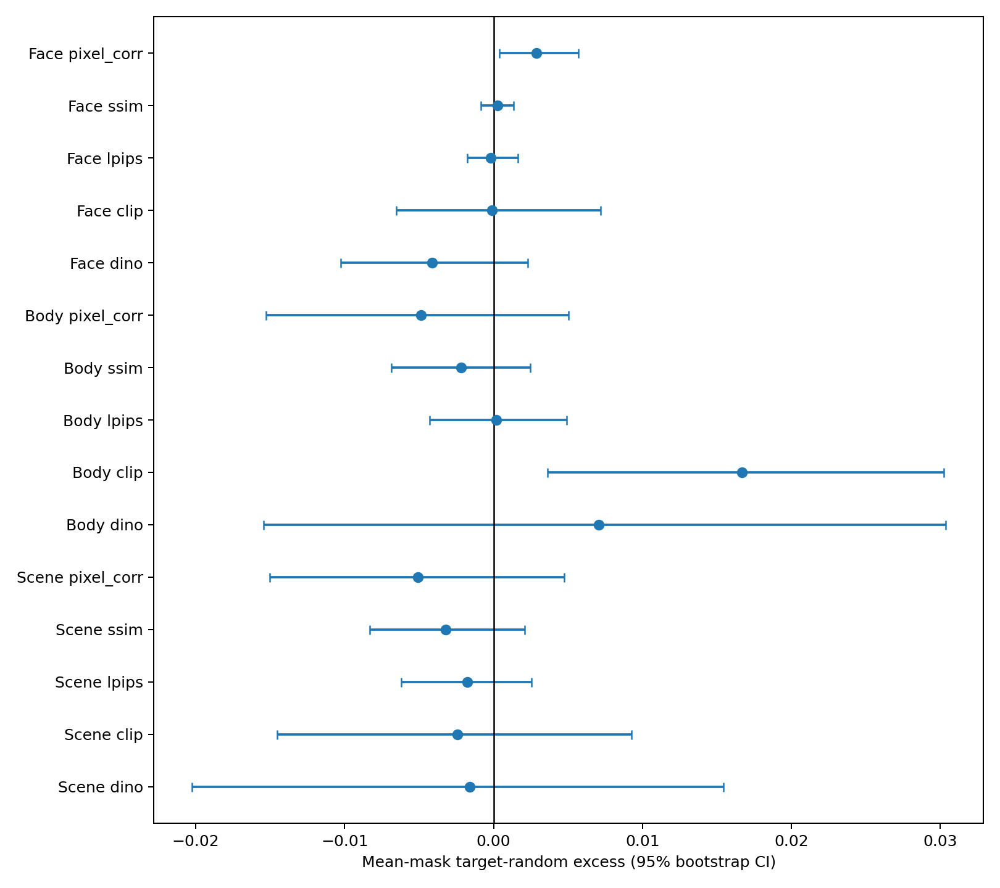
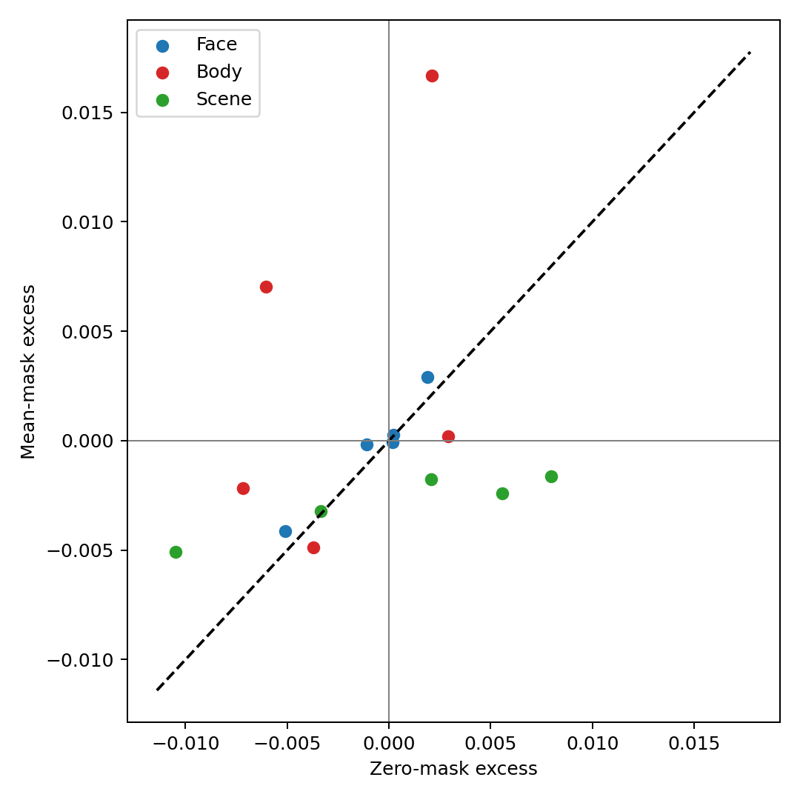
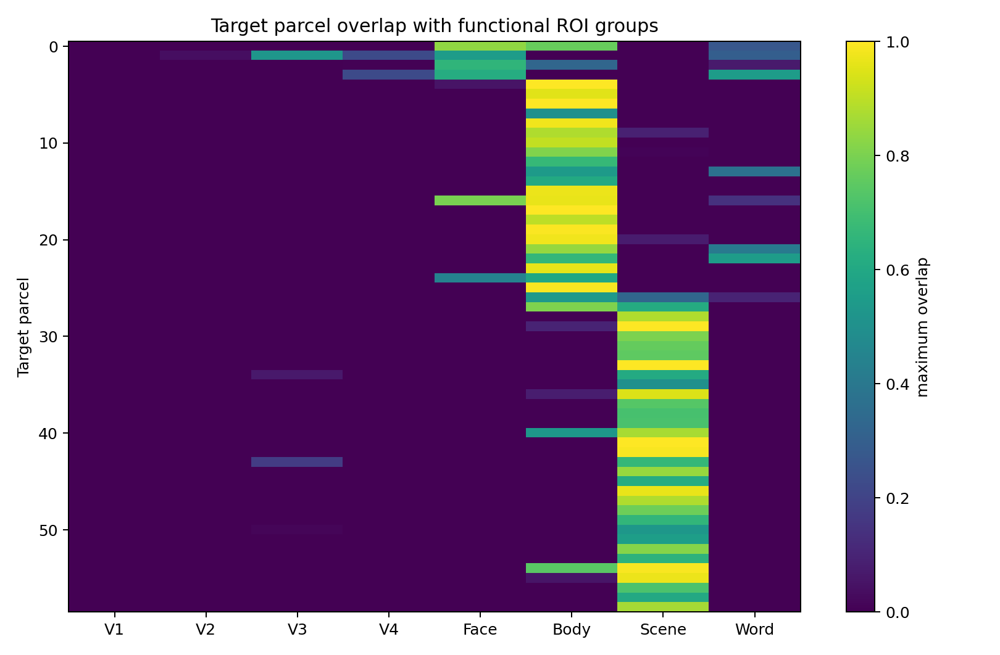
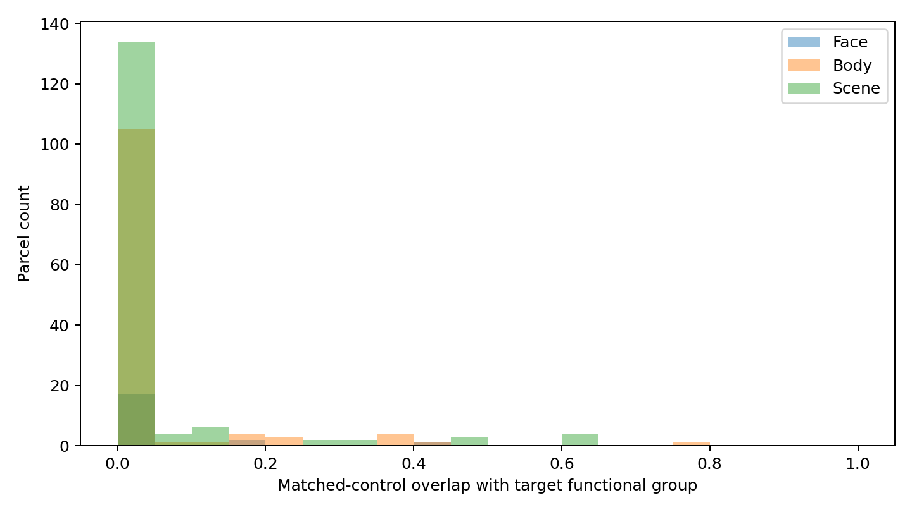
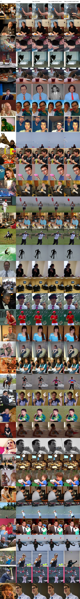
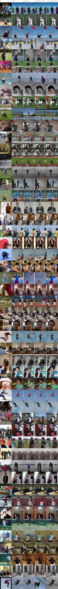
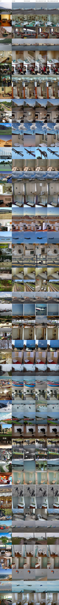

# E2b mean-mask 正式稳健性实验

本实验与正式 zero-mask 使用相同 Subject 1、step-100000 checkpoint、
Face 37、Body 50、Scene 50、3 个 seed、冻结 ROI/random controls、
50 步扩散与 factor 4.0。唯一主要变化是以 9000 个训练样本的
parcel-wise mean 替换指定 token。

## 工程验收

- plan 等价审计通过；
- smoke 3/3 图片、39/39 条件通过；
- 正式 9/9 runs、411/411 确定性检查、5499/5499 干预审计通过；
- 非目标最大变化为 `0.0`；
- 所有运行使用同一 checkpoint、mean cache 和代码提交；
- zero/mean 的 no-mask PNG SHA 完全一致；
- 三张完整 comparison grid 逐行检查无空白、损坏、错位或条件列异常。

## 主要结果

15 项主要检验经全局 BH 校正后，没有校正显著的正向结果。最小的正向
未校正 p 为 Body CLIP（excess `0.01667`，p `0.0172`，q `0.2580`）；
Face PixCorr 为 excess `0.00290`、p `0.0420`、q `0.3154`。二者均不
达到预注册的校正阈值。

Body equal-k CLIP 为显著负向 excess（约 `-0.01104`），方向不支持
类别匹配 ROI 假设。其他 equal-k 指标也没有校正显著的正向结果。

## Zero 与 mean

15 项中 10 项方向一致，4 项共同为正，6 项共同为负。整体 Pearson
相关为 `0.230`，Spearman 为 `0.400`；15 项 mean-zero 配对差异均未
通过独立的次要 BH 校正。

结果属于预定义情况 A：在当前公开 ROI 映射、当前 checkpoint 和
zero/mean 两种 parcel 干预下，没有获得稳健的类别匹配 ROI 额外因果
贡献证据。这不等于对应脑区没有生物学功能。

详细数字见 `primary_results.csv`、`secondary_equal_k_results.csv`、
`zero_vs_mean_robustness.csv` 和 `zero_vs_mean_summary.json`。

## 图表

