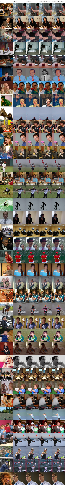
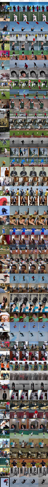
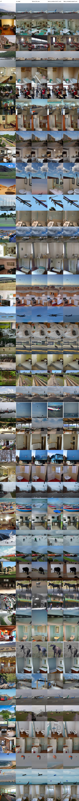

# E2 正式 zero-mask 因果消融实验

## 配置

- Subject：1
- Checkpoint：step 100000
- 样本：Face 37、Body 50、Scene 50
- Seeds：12345、23456、34567
- 扩散步数：50
- Guidance/noise factor：4.0
- 干预：zero-mask
- 随机对照：5 组，匹配 parcel 数量、半球、mean ncsnr 和大小
- 统计单位：图像；先平均同一图像的 3 个 seed

主要分析为 full target ROI 相对 5 组 full matched-random 的 causal loss
差。正值表示目标 ROI 屏蔽造成的下降更大。15 个主要检验统一使用
Benjamini-Hochberg 校正。

## 工程审计

| 项目 | 结果 |
| --- | ---: |
| 完整运行 | 9/9 |
| Image-seed pairs | 411 |
| 确定性 SHA-256 检查 | 411/411 |
| Intervention audits | 5499/5499 |
| 非目标 parcel 最大变化量 | 0.0 |
| 审计失败 | 0 |

## 主要结果

| 类别 | 指标 | Target-random excess | 95% CI | p | 全局 q（15 项） |
| --- | --- | ---: | --- | ---: | ---: |
| Face | PixCorr | 0.00190 | [-0.00097, 0.00480] | 0.21884 | 0.60104 |
| Face | SSIM | 0.00021 | [-0.00102, 0.00143] | 0.74176 | 0.79475 |
| Face | LPIPS | -0.00110 | [-0.00283, 0.00068] | 0.23304 | 0.60104 |
| Face | CLIP | 0.00017 | [-0.00775, 0.00802] | 0.96690 | 0.96690 |
| Face | DINO | -0.00511 | [-0.01607, 0.00701] | 0.41828 | 0.65969 |
| Body | PixCorr | -0.00371 | [-0.01345, 0.00643] | 0.47208 | 0.65969 |
| Body | SSIM | -0.00716 | [-0.01148, -0.00257] | 0.00285 | 0.04275 |
| Body | LPIPS | 0.00290 | [-0.00196, 0.00765] | 0.25109 | 0.60104 |
| Body | CLIP | 0.00211 | [-0.00910, 0.01448] | 0.73261 | 0.79475 |
| Body | DINO | -0.00603 | [-0.02536, 0.01313] | 0.54917 | 0.68647 |
| Scene | PixCorr | -0.01049 | [-0.02497, 0.00363] | 0.15799 | 0.60104 |
| Scene | SSIM | -0.00335 | [-0.01000, 0.00378] | 0.37128 | 0.65969 |
| Scene | LPIPS | 0.00208 | [-0.00382, 0.00789] | 0.48378 | 0.65969 |
| Scene | CLIP | 0.00556 | [-0.00406, 0.01561] | 0.28049 | 0.60104 |
| Scene | DINO | 0.00795 | [-0.00427, 0.02069] | 0.22599 | 0.60104 |

没有任何校正显著结果支持“关闭类别匹配 ROI 比随机关闭相似 parcel 使
重建下降更多”。唯一 `q<0.05` 的 Body SSIM excess 为负，方向与研究
假设相反。Face PixCorr 和 Scene DINO 的 pilot 信号未在正式样本与
3 seeds 下复现。

Body/Scene equal-k=4 次要分析也没有校正显著的正向结果，所有设计内
`q>=0.12199`。

## 解释边界

本结果说明：在当前公开 Algonauts ROI 映射、step-100000
`linear_projection` checkpoint、zero-mask 干预和已验证的匹配随机对照
下，没有获得类别特异性因果贡献的支持证据。它不能证明这些脑区在生物学
上没有功能，也不能替代作者未公开 ROI metadata 下的附录 P 实验。

## 产物

```text
e2_output_audit.json
e2_metrics_summary.json
face_per_sample_metrics.csv
body_per_sample_metrics.csv
scene_per_sample_metrics.csv
figures/face_comparison_grid.jpg
figures/body_comparison_grid.jpg
figures/scene_comparison_grid.jpg
```







服务器完整无损输出：

```text
/public/home/mty/GeYugong/projects/neuroadapter-iclr2026/outputs/roi_ablation/
E2_top_snr_causal_full
```
