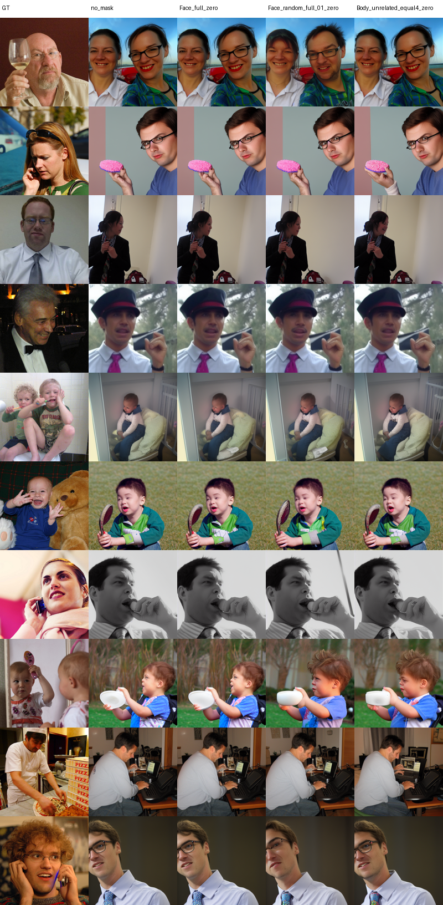
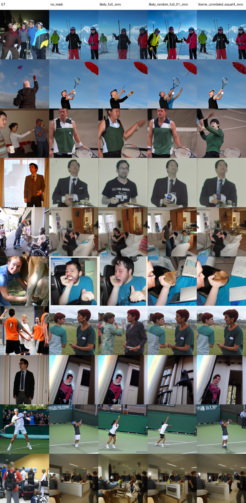
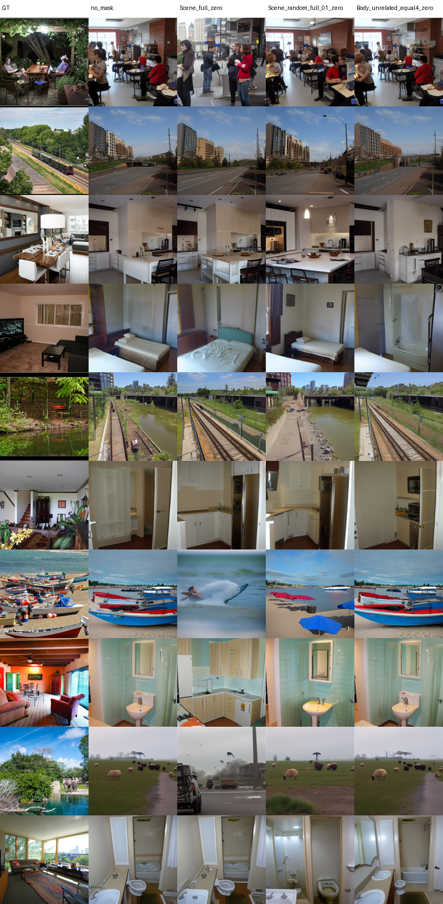

# E2 zero-mask 因果消融 pilot

## 实验配置

- Subject：1
- Checkpoint：step 100000
- 类别与样本：Face 10、Body 10、Scene 10
- Seed：12345
- 扩散步数：50
- Guidance/noise factor：4.0
- 干预：zero-mask
- 对照：full-group、equal-k=4、5 组匹配随机 parcel、无关 ROI
- 随机匹配变量：parcel 数量、半球、mean ncsnr、parcel 大小

同一图像的所有条件共用 fMRI、初始 VAE latent、初始 diffusion noise、
DDPM 每一步方差噪声、模型、seed 和扩散参数。30/30 个跨 condition batch
的 no-mask 重复图像 SHA-256 完全一致，非目标 parcel 最大变化量为 0.0。

## 目标 ROI 相对随机对照

表中 `excess` 为目标 ROI causal loss 减去 5 组匹配随机对照的平均 causal
loss。正值表示关闭目标 ROI 后下降更多。`q` 是同一设计内 5 个指标的
Benjamini-Hochberg 校正结果。

| 类别 | 设计 | 指标 | Excess | 95% CI | p | q |
| --- | --- | --- | ---: | --- | ---: | ---: |
| Face | full=4 | PixCorr | 0.00696 | [0.00220, 0.01227] | 0.0182 | 0.0910 |
| Body | equal-k=4 | SSIM | -0.00926 | [-0.01656, -0.00254] | 0.0332 | 0.1660 |
| Scene | full=31 | DINO | 0.04394 | [0.01465, 0.08386] | 0.0120 | 0.0600 |

以上是各设计中未经校正最强的指标。没有结果达到 `q < 0.05`。Face 和
Scene 出现值得扩大样本验证的正向信号；Body 没有跨指标一致的目标 ROI
优势。本 pilot 不能作为正式功能特异性结论。

## 产物

```text
e2_metrics_summary.json
face_per_sample_metrics.csv
body_per_sample_metrics.csv
scene_per_sample_metrics.csv
figures/face_comparison_grid.png
figures/body_comparison_grid.png
figures/scene_comparison_grid.png
```







服务器完整生成结果：

```text
/public/home/mty/GeYugong/projects/neuroadapter-iclr2026/outputs/roi_ablation/
E2_top_snr_causal_pilot/seed_12345
```
