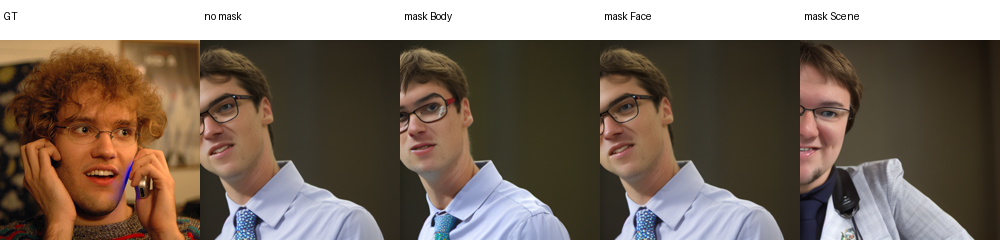
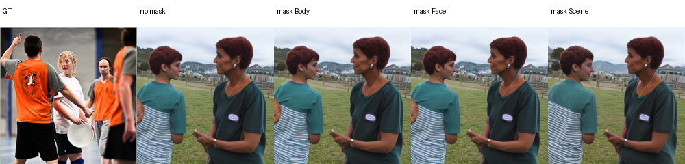
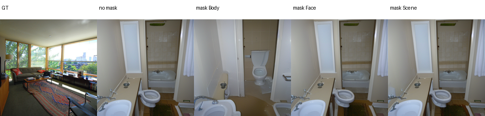
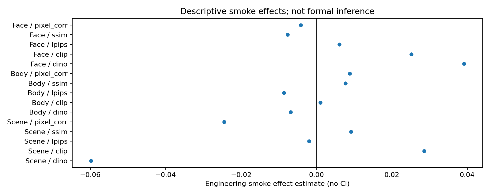

# E3a 类别 × ROI 交互实验：工程 smoke

本目录记录 E3a 的实现与工程 smoke，不包含 pilot 或正式统计结果。

## 设计

- 刺激类别：Face、Body、Scene；
- 被干预 ROI：Face、Body、Scene；
- 构成完整 `3 × 3` 设计；
- 每个 ROI 固定取 4 个最高 SNR parcel；
- 使用 Subject 1 训练集 parcel mean replacement；
- 每个目标条件配 5 组 pure matched-random controls；
- pure control 对相应目标 ROI 的最大 overlap 严格 `< 0.10`；
- 对照继续匹配 parcel 数量、半球、mean ncsnr 和 parcel 大小。

工程 smoke 只使用每类 1 张冻结图片和 seed 12345。`interaction_results.csv`
中的 CI、p 和 q 均为空，不能用于科研结论。

## 审计结果

- Face、Body、Scene 共 3 个任务全部完成；
- 每类 20 个条件，共 60 条 condition-image 记录；
- no-mask 与 no-mask-repeat 的 PNG SHA-256 完全一致；
- 非目标 parcel 最大变化量为 `0.0`；
- checkpoint 和 mean cache 哈希在 3 个任务中一致；
- plan equivalence 与 pure-control matching audit 均通过。

## 局部指标限制

COCO person polygon 用于 Body person region 和 Scene background。服务器当前
OpenCV 安装缺少 `CascadeClassifier`，Face smoke 显式退回 scikit-image
自带 LBP cascade。该 fallback 没有下载权重，但与 E1 的 OpenCV Haar
后端不完全相同，因此正式实验前必须恢复或重新冻结人脸检测后端。

## 主要文件

```text
plan.json
plan_equivalence_audit.json
control_matching_audit.json
output_audit.json
per_sample_metrics.csv
per_image_excess_effects.csv
interaction_results.csv
local_metric_results.csv
evaluation_summary.json
figures/
```








