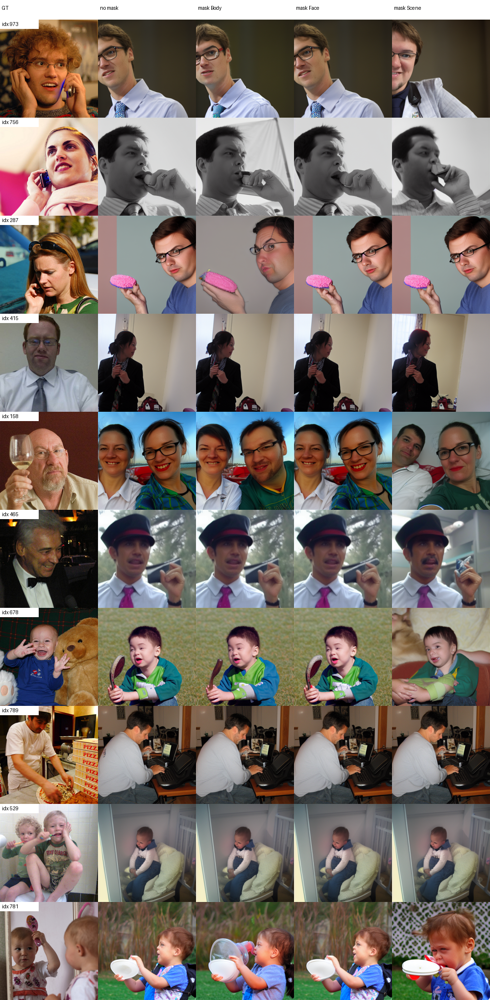
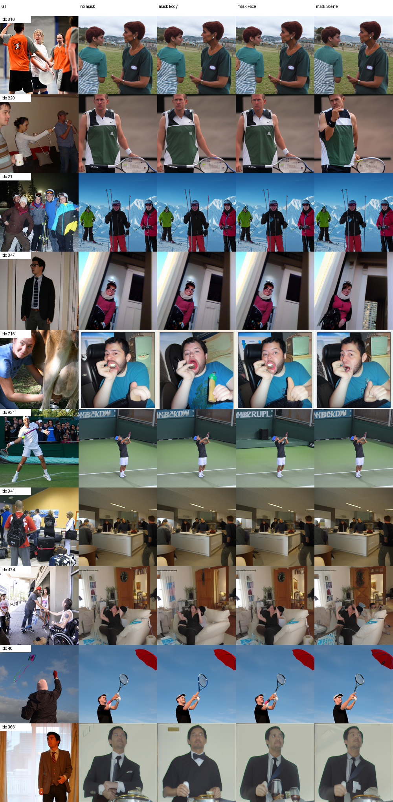
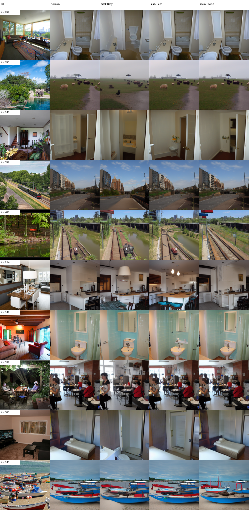
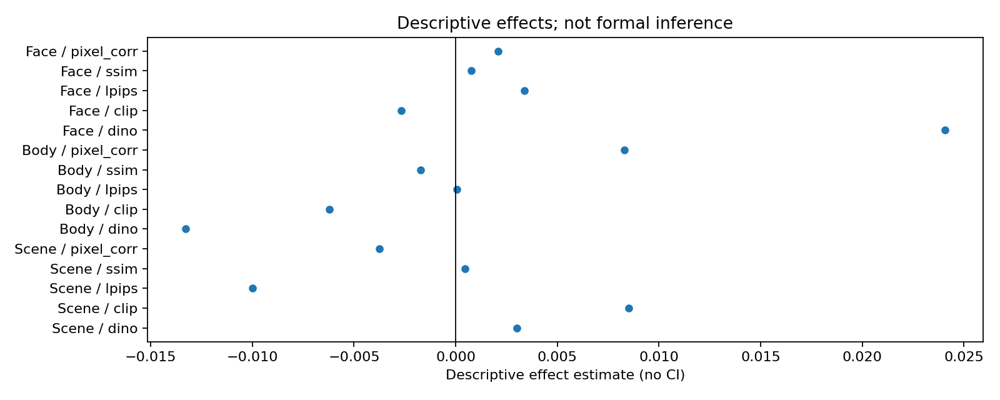
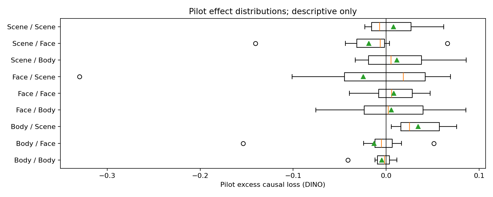

# E3a 类别×ROI 交互 pilot

## 目的

E3a 检查被干预 ROI 的影响是否随刺激类别变化。实验对 Face、Body、
Scene 各取 10 张冻结图片，分别干预 Face、Body、Scene ROI；所有干预均
使用训练集 parcel mean、`equal-k=4`、5 组 pure matched-random controls
和 seed `12345`。

本目录是工程 pilot，不执行正式显著性推断。效应量、分布和异常值只能
用于判断实验设计与后续样本量，不能作为脑区功能结论。

## 完成情况

| 项目 | 结果 |
| --- | ---: |
| 类别任务 | 3/3 通过 |
| 图片 | 30 |
| 每张图条件数 | 20 |
| condition-image records | 600 |
| per-sample 指标 | 600 |
| 局部指标 | 600 |
| 确定性检查 | 30/30 通过 |
| 非目标 parcel 最大变化 | 0.0 |
| 缺图、错位、NaN、空区域 | 0 |

同一图片的全部条件共享相同 initial latent 和 diffusion noise。三个类别
使用同一 checkpoint、mean cache 和推理代码提交。plan、条件、刺激索引、
随机对照、图片 SHA 和 GT 对齐均通过独立审计。

Face 指标使用与 E1 相同的 OpenCV 4.12 Haar detector，参数为
`scaleFactor=1.1`、`minNeighbors=5`、`minSize=(24,24)`；cascade
SHA-256 为
`0f7d4527844eb514d4a4948e822da90fbb16a34a0bbbbc6adc6498747a5aafb0`。
预测图中 79/200 次检测到人脸；未检测到时仍使用由 GT 冻结的有效局部
区域，因此没有空 Face 区域。

## 描述性结果

类别匹配减非匹配的 DINO 交互效应为：

| 被干预 ROI | 描述性效应 |
| --- | ---: |
| Face | 0.02407 |
| Body | -0.01329 |
| Scene | 0.00300 |

15 项交互摘要方向不一致，不能形成统一的类别特异性趋势。逐图分布较宽，
且存在少数高影响样本。例如 Face 图片 `dataset_idx=678` 在 mask Scene
时 DINO excess 为 `-0.32962`。该样本在 E3b 中也表现为高敏感样本，
说明它不是文件错配，但 pilot 每类只有 10 张图，单样本会显著影响均值。

## 人工审图

Face、Body、Scene 三张 comparison grid 已逐行检查，共覆盖全部 30 张
pilot 图片。GT、dataset index 与条件列对齐，图片均非空，没有标题重叠
或明显渲染损坏。不同条件对部分图片产生可见语义或构图变化，另一些图片
变化较小；视觉结果同样表现出明显的图像间异质性。

## 关键产物

- `plan.json`：冻结图片、parcel、条件、模型资产与随机对照；
- `output_audit.json`：推理完整性和共享随机状态审计；
- `evaluation_audit.json`：指标、区域和 detector 审计；
- `per_sample_metrics.csv`：逐条件全局指标；
- `local_metric_results.csv`：逐条件局部指标；
- `per_image_excess_effects.csv`：逐图 excess causal loss；
- `interaction_results.csv`：15 项描述性交互摘要；
- `effect_distribution_summary.csv`：逐条件分布统计。

推理与评价代码提交为 `b4e2b99550c4df21911f947100c9bf5df23dddb7`；
最终重绘和审计代码提交为 `bf27065f3f9910ba754ec71853f1e7cb50a342f6`。
