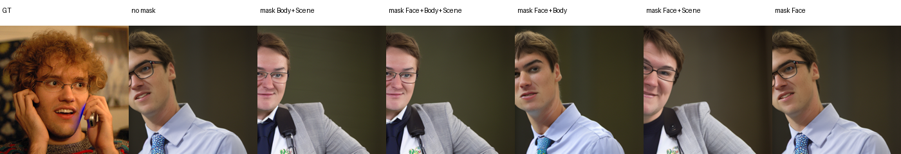
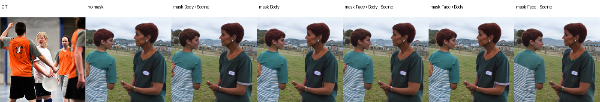
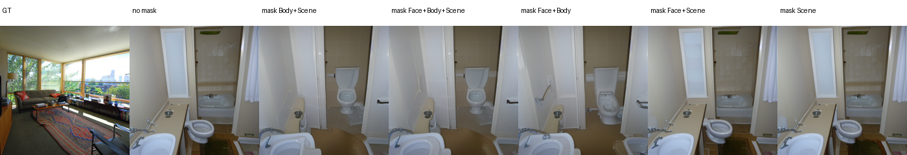
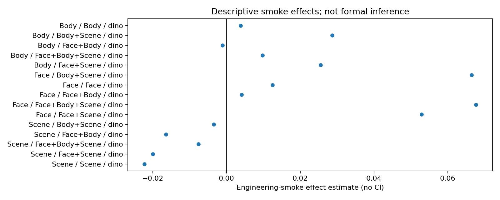

# E3b 联合 ROI 冗余实验：工程 smoke

本目录记录 E3b 的实现与工程 smoke，不包含 pilot 或正式统计结果。

## 设计

每个刺激类别包含以下目标干预：

```text
类别匹配单 ROI（4 parcels）
Face + Body（8 parcels）
Face + Scene（8 parcels）
Body + Scene（8 parcels）
Face + Body + Scene（12 parcels）
```

每个目标条件分别生成 5 组相同 parcel 数量的 pure matched-random
controls。候选 parcel 对联合条件中的每个目标 ROI 都要求 overlap
`< 0.10`，并匹配半球、mean ncsnr 和 parcel 大小。

工程 smoke 只使用每类 1 张冻结图片和 seed 12345。`joint_mask_results.csv`
只包含描述性效应量，CI、p 和 q 均为空。

## 审计结果

- Face、Body、Scene 共 3 个任务全部完成；
- 每类 32 个条件，共 96 条 condition-image 记录；
- 所有 4/8/12-token 对照数量与目标条件一致；
- no-mask 与 no-mask-repeat 的 PNG SHA-256 完全一致；
- 非目标 parcel 最大变化量为 `0.0`；
- checkpoint 和 mean cache 哈希在 3 个任务中一致；
- plan equivalence 与 pure-control matching audit 均通过。

Face 局部指标在 smoke 中使用显式记录的 scikit-image LBP fallback；它不
能在未经重新冻结的情况下用于正式 E3。

## 主要文件

```text
plan.json
plan_equivalence_audit.json
control_matching_audit.json
output_audit.json
per_sample_metrics.csv
per_image_excess_effects.csv
joint_mask_results.csv
local_metric_results.csv
evaluation_summary.json
figures/
```








