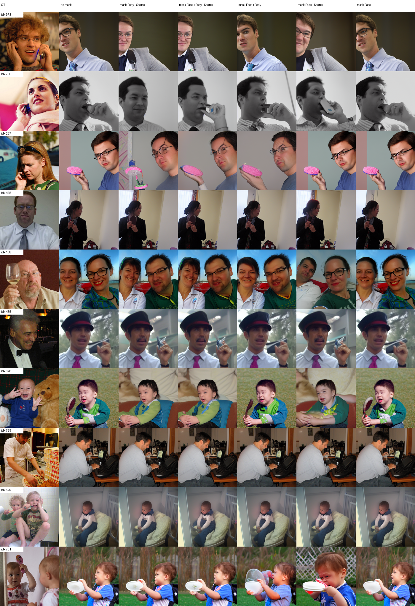
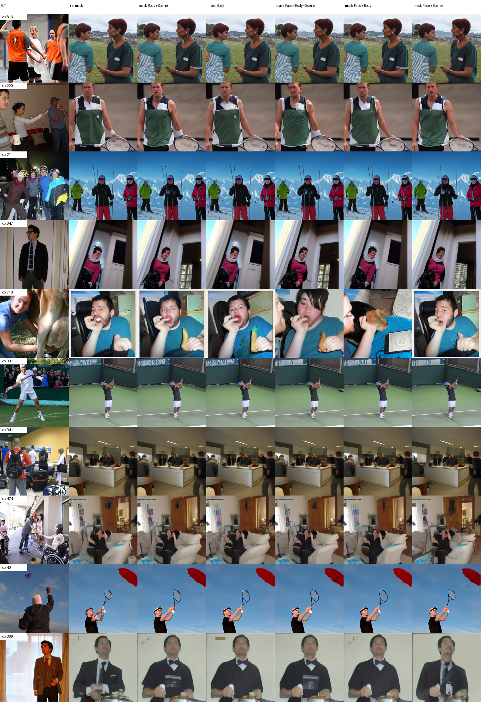
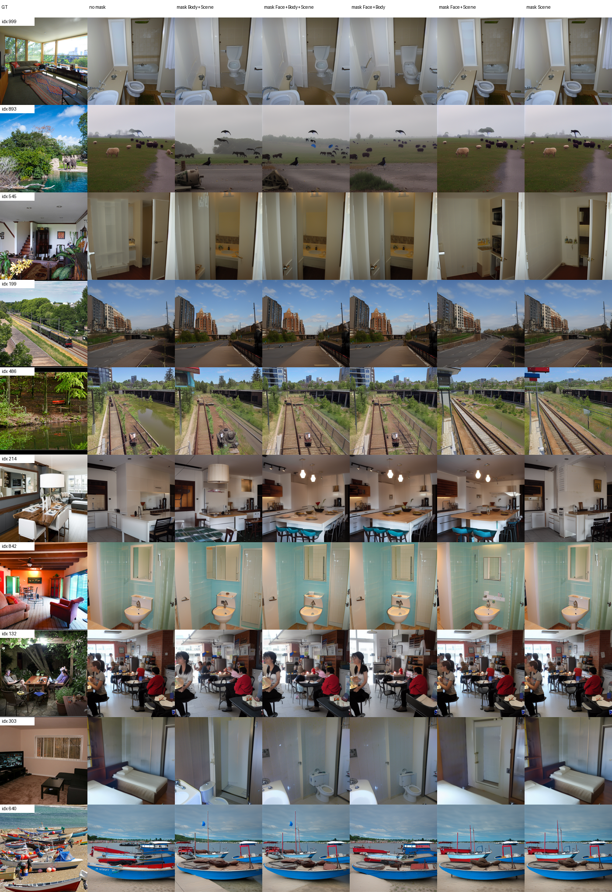
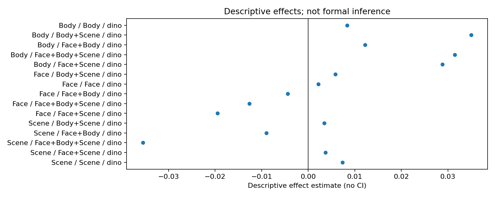
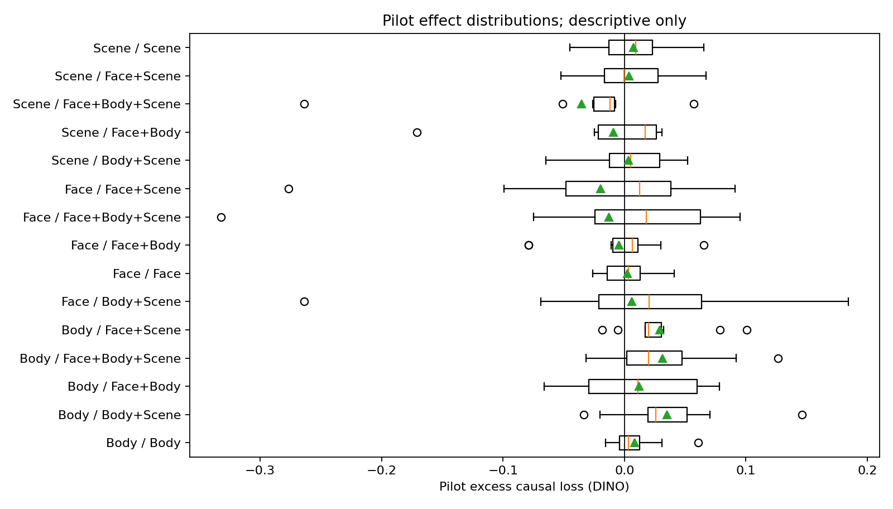

# E3b 联合 ROI 冗余 pilot

## 目的

E3b 检查单 ROI 干预较弱时，多个高层 ROI 的联合干预是否产生更强影响。
Face、Body、Scene 各取 10 张冻结图片；每类包含类别匹配单 ROI、三个双
ROI 组合、Face+Body+Scene 联合干预及其 5 组 pure matched-random
controls。所有条件使用训练集 parcel mean、seed `12345` 和 50 步扩散。

本目录是工程 pilot，不执行正式显著性推断。结果用于发现工程异常、检查
效应分布和决定是否值得进入三 seed 正式实验。

## 完成情况

| 项目 | 结果 |
| --- | ---: |
| 类别任务 | 3/3 通过 |
| 图片 | 30 |
| 每张图条件数 | 32 |
| condition-image records | 960 |
| per-sample 指标 | 960 |
| 局部指标 | 960 |
| 确定性检查 | 30/30 通过 |
| 非目标 parcel 最大变化 | 0.0 |
| 缺图、错位、NaN、空区域 | 0 |

同一图片的 32 个条件共享相同 initial latent 和 diffusion noise。所有
类别使用同一 checkpoint、mean cache 和代码提交；4、8、12 token 条件
均使用各自等数量的 pure controls，没有复用较小条件的随机对照。

Face 指标使用与 E1 完全相同的 OpenCV Haar detector。预测图中
135/320 次检测到人脸；所有 GT 冻结局部区域均非空，最小区域为
16641 pixels。

## 描述性结果

DINO 的 `target_minus_pure_random` 没有随联合 ROI 数量单调增大：

| 图片类别 | 匹配单 ROI | 三 ROI 联合 |
| --- | ---: | ---: |
| Face | 0.00219 | -0.01262 |
| Body | 0.00839 | 0.03145 |
| Scene | 0.00735 | -0.03547 |

Body 图片在多种联合干预下呈正向描述性效应，其中三 ROI 联合为
`0.03145`；Face 和 Scene 的三 ROI 联合效应为负。由此不能在 pilot
阶段得出一致的“联合干预越强，重建下降越大”趋势。

逐图分布宽且包含稳定的高敏感样本。Face 图片 `dataset_idx=678` 在三
ROI 联合干预下 DINO excess 为 `-0.33216`，Scene 图片
`dataset_idx=214` 为 `-0.26384`；正向极端值包括 Face 图片
`dataset_idx=756` 的 Body+Scene 条件 `0.18425`。这些变化通过文件和
对齐审计，但每类只有 10 张图，不能用于正式推断。

## 人工审图

Face、Body、Scene 三张 comparison grid 已逐行检查，覆盖全部 30 张
pilot 图片。GT、dataset index 和条件列均对齐，图片非空，无明显布局或
渲染错误。可见变化在图像之间差异较大，没有出现普遍且单调增强的联合
消融现象，与描述性分布结果一致。

## 关键产物

- `plan.json`：冻结图片、单/联合 parcel、模型资产与随机对照；
- `output_audit.json`：推理完整性和共享随机状态审计；
- `evaluation_audit.json`：指标、区域和 detector 审计；
- `per_sample_metrics.csv`：逐条件全局指标；
- `local_metric_results.csv`：逐条件局部指标；
- `per_image_excess_effects.csv`：逐图 excess causal loss；
- `joint_mask_results.csv`：联合干预描述性摘要；
- `effect_distribution_summary.csv`：逐条件分布统计。

推理与评价代码提交为 `b4e2b99550c4df21911f947100c9bf5df23dddb7`；
最终重绘和审计代码提交为 `bf27065f3f9910ba754ec71853f1e7cb50a342f6`。
